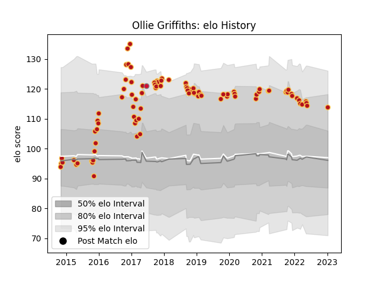

---  
layout: page  
title: Ollie Griffiths  
date: 2023-01-13 11:34:21.315995  
categories: player  
---
# Ollie Griffiths

## Positions: FL, N8

## Country: Wales

## Current elo: 114.0

## Current Percentile: 85.0

# Elo History

# Match History

| Team    |   Appearances |   Win Rate |
|:--------|--------------:|-----------:|
| Dragons |            92 |   0.315217 |
| Wales   |             1 |   1        |

| Opponent           |   Matches |   Win Rate |
|:-------------------|----------:|-----------:|
| Benetton Treviso   |         8 |   0.5625   |
| Ulster             |         8 |   0.0625   |
| Edinburgh          |         8 |   0.375    |
| Cardiff Blues      |         7 |   0        |
| Glasgow Warriors   |         7 |   0.428571 |
| Munster            |         7 |   0        |
| Ospreys            |         6 |   0.166667 |
| Scarlets           |         6 |   0.333333 |
| Leinster           |         5 |   0        |
| Worcester Warriors |         3 |   0.666667 |
| Connacht           |         3 |   0.666667 |
| Timisoara Saracens |         2 |   1        |
| Southern Kings     |         2 |   1        |
| RC Enisei          |         2 |   1        |
| Pau                |         2 |   1        |
| Newcastle Falcons  |         2 |   0        |
| Northampton Saints |         2 |   0        |
| Bulls              |         2 |   0        |
| Zebre              |         2 |   0.5      |
| Brive              |         1 |   0        |
| Lions              |         1 |   0        |
| Sale Sharks        |         1 |   1        |
| Harlequins         |         1 |   0        |
| Clermont Auvergne  |         1 |   0        |
| Stormers           |         1 |   0        |
| Cheetahs           |         1 |   1        |
| Tonga              |         1 |   1        |
| Castres Olympique  |         1 |   0        |