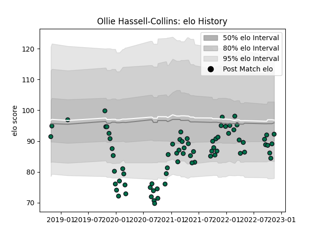

---  
layout: page  
title: Ollie Hassell-Collins  
date: 2023-03-17 17:10:15.687434  
categories: player  
---
# Ollie Hassell-Collins

## Positions: W

## Country: England

## Current elo: 93.0

## Current Percentile: 25.0

# Elo History

# Match History

| Team         |   Appearances |   Win Rate |
|:-------------|--------------:|-----------:|
| London Irish |            92 |   0.391304 |
| England      |             2 |   0.5      |

| Opponent            |   Matches |   Win Rate |
|:--------------------|----------:|-----------:|
| Sale Sharks         |         8 |   0.25     |
| Harlequins          |         7 |   0.357143 |
| Gloucester Rugby    |         7 |   0.357143 |
| Exeter Chiefs       |         6 |   0.333333 |
| Northampton Saints  |         6 |   0.166667 |
| Leicester Tigers    |         6 |   0.166667 |
| Worcester Warriors  |         6 |   0.333333 |
| Wasps               |         6 |   0.416667 |
| Saracens            |         5 |   0.5      |
| Newcastle Falcons   |         5 |   0.8      |
| Bristol Rugby       |         5 |   0.3      |
| Bath Rugby          |         5 |   0.4      |
| Toulon              |         3 |   0        |
| Scarlets            |         2 |   0        |
| Stormers            |         2 |   0        |
| Montpellier Herault |         2 |   0.25     |
| Scotland            |         1 |   0        |
| Pau                 |         1 |   1        |
| Agen                |         1 |   1        |
| London Scottish     |         1 |   1        |
| Italy               |         1 |   1        |
| Edinburgh           |         1 |   1        |
| Coventry            |         1 |   1        |
| Cornish Pirates     |         1 |   1        |
| Castres Olympique   |         1 |   1        |
| Cardiff Blues       |         1 |   1        |
| Bedford             |         1 |   1        |
| Bayonne             |         1 |   1        |
| Jersey              |         1 |   0        |