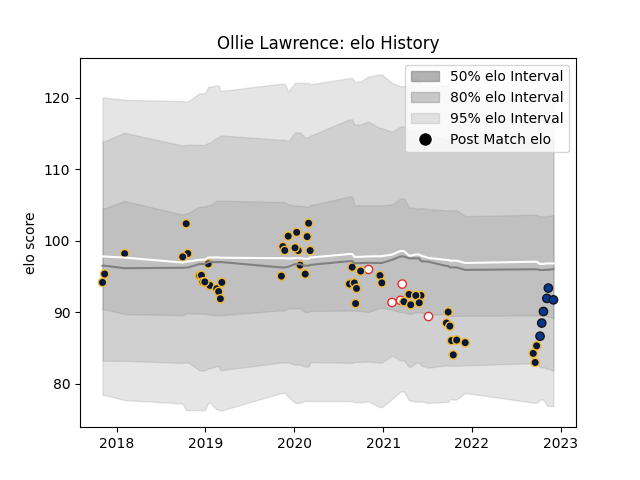

---  
layout: page  
title: Ollie Lawrence  
date: 2023-01-06 00:17:19.831516  
categories: player  
---
# Ollie Lawrence

## Positions: C

## Country: England

## Current elo: 95.0

## Current Percentile: 25.0

# Elo History

# Match History

| Team               |   Appearances |   Win Rate |
|:-------------------|--------------:|-----------:|
| Worcester Warriors |            52 |   0.326923 |
| Bath Rugby         |            10 |   0.4      |
| England            |             5 |   0.6      |

| Opponent                 |   Matches |   Win Rate |
|:-------------------------|----------:|-----------:|
| Harlequins               |         7 |   0.285714 |
| Leicester Tigers         |         5 |   0.4      |
| Exeter Chiefs            |         5 |   0        |
| Northampton Saints       |         5 |   0.2      |
| Newcastle Falcons        |         5 |   0.6      |
| Saracens                 |         4 |   0.25     |
| London Irish             |         3 |   0.666667 |
| Sale Sharks              |         3 |   0.333333 |
| Ospreys                  |         3 |   0.666667 |
| Wasps                    |         3 |   0.333333 |
| Gloucester Rugby         |         3 |   0        |
| Bristol Rugby            |         2 |   0        |
| Pau                      |         2 |   0.5      |
| RC Enisei                |         2 |   1        |
| Dragons                  |         2 |   0.5      |
| Castres Olympique        |         2 |   0        |
| Stade Francais Paris     |         2 |   1        |
| Bath Rugby               |         2 |   0        |
| Italy                    |         1 |   1        |
| Ireland                  |         1 |   0        |
| Glasgow Warriors         |         1 |   0        |
| France                   |         1 |   1        |
| Scotland                 |         1 |   0        |
| Toulon                   |         1 |   0        |
| United States of America |         1 |   1        |