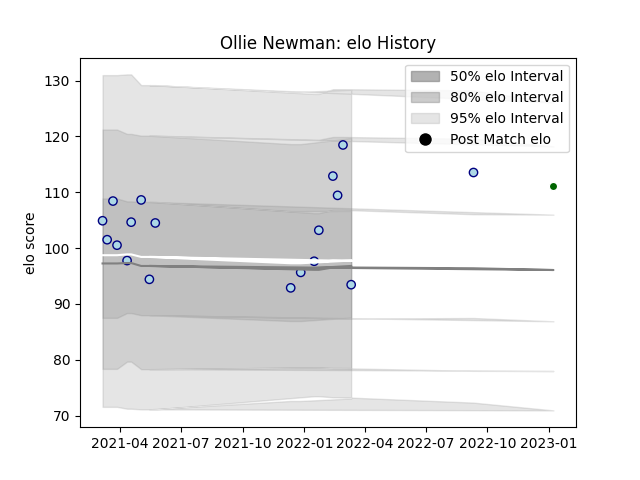

---  
layout: page  
title: Ollie Newman  
date: 2023-03-21 18:31:08.810777  
categories: player  
---
# Ollie Newman

Last updated: 2023-03-21
## Positions: FL

## Current elo: 94.0

## Current Percentile: 90.0

# Elo History

# Match History

| Team                |   Appearances |   Win Rate |
|:--------------------|--------------:|-----------:|
| Bedford             |            18 |   0.333333 |
| Ealing Trailfinders |             4 |   0.75     |

| Opponent            |   Matches |   Win Rate |
|:--------------------|----------:|-----------:|
| Coventry            |         3 |   0        |
| Nottingham          |         3 |   0.666667 |
| Richmond            |         3 |   0.666667 |
| Cornish Pirates     |         2 |   0        |
| Ealing Trailfinders |         2 |   0.5      |
| Jersey              |         2 |   0.5      |
| London Scottish     |         2 |   1        |
| Ampthill            |         1 |   0        |
| Caldy               |         1 |   0        |
| Doncaster           |         1 |   0        |
| Hartpury College    |         1 |   1        |
| Saracens            |         1 |   0        |