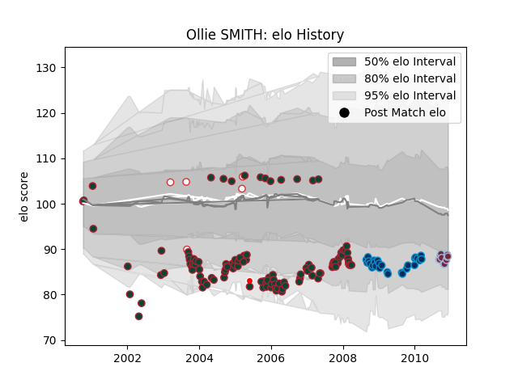

---  
layout: page  
title: Ollie SMITH  
date: 2023-03-29 11:28:00.475225  
categories: player  
---
# Ollie SMITH

Last updated: 2023-03-29
## Positions: C, W

## Country: British and Irish Lions

## Current elo: 88.0

## Current Percentile: 22.0

# Elo History

# Match History

| Team                    |   Appearances |   Win Rate |
|:------------------------|--------------:|-----------:|
| Leicester Tigers        |           121 |   0.661157 |
| Montpellier Herault     |            29 |   0.482759 |
| Harlequins              |            14 |   0.5      |
| England                 |             5 |   0.8      |
| British and Irish Lions |             1 |   0.5      |

| Opponent             |   Matches |   Win Rate |
|:---------------------|----------:|-----------:|
| Wasps                |        12 |   0.708333 |
| Sale Sharks          |        11 |   0.272727 |
| Bath Rugby           |         9 |   0.5      |
| Newcastle Falcons    |         9 |   0.722222 |
| London Irish         |         8 |   0.75     |
| Leeds                |         8 |   0.75     |
| Gloucester Rugby     |         8 |   0.5      |
| Stade Francais Paris |         7 |   0.428571 |
| Northampton Saints   |         7 |   0.428571 |
| Saracens             |         7 |   0.642857 |
| Worcester Warriors   |         7 |   0.714286 |
| Stade Toulousain     |         6 |   0.333333 |
| Harlequins           |         6 |   1        |
| Clermont Auvergne    |         4 |   0.75     |
| Bristol Rugby        |         4 |   0.5      |
| Leinster             |         4 |   0.75     |
| Castres Olympique    |         3 |   0.666667 |
| Munster              |         3 |   0.666667 |
| Calvisano            |         3 |   1        |
| Biarritz Olympique   |         3 |   0        |
| Bayonne              |         3 |   0        |
| Rotherham Titans     |         2 |   1        |
| Perpignan            |         2 |   0.5      |
| Pau                  |         2 |   1        |
| Toulon               |         2 |   0.5      |
| Neath  Swansea       |         2 |   1        |
| Yorkshire Carnegie   |         2 |   1        |
| Leicester Tigers     |         2 |   0.5      |
| Italy                |         2 |   1        |
| Glasgow Warriors     |         2 |   1        |
| Beziers              |         2 |   1        |
| Bourgoin-Jallieu     |         2 |   0        |
| Edinburgh            |         2 |   0.5      |
| Dax                  |         2 |   1        |
| Montauban            |         1 |   1        |
| Cardiff Blues        |         1 |   1        |
| Wales                |         1 |   1        |
| Ulster               |         1 |   0        |
| Brive                |         1 |   0        |
| EbbwaleNewport       |         1 |   1        |
| Scotland             |         1 |   1        |
| Llanelli             |         1 |   1        |
| Exeter Chiefs        |         1 |   1        |
| Racing 92            |         1 |   1        |
| France               |         1 |   0        |
| Argentina            |         1 |   0.5      |