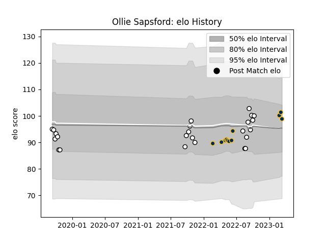

---  
layout: page  
title: Ollie Sapsford  
date: 2023-03-21 18:15:30.836864  
categories: player  
---
# Ollie Sapsford

Last updated: 2023-03-21
## Positions: W, C

## Current elo: 100.0

## Current Percentile: 58.0

# Elo History

# Match History

| Team        |   Appearances |   Win Rate |
|:------------|--------------:|-----------:|
| Hawke's Bay |            24 |   0.604167 |
| Brumbies    |            12 |   0.75     |

| Opponent                 |   Matches |   Win Rate |
|:-------------------------|----------:|-----------:|
| Bay of Plenty            |         4 |   0.25     |
| Tasman                   |         4 |   0.5      |
| Wellington               |         3 |   0.333333 |
| Waikato                  |         3 |   0.833333 |
| Blues                    |         3 |   0.333333 |
| Otago                    |         2 |   0.5      |
| Canterbury               |         2 |   0.5      |
| Hurricanes               |         2 |   1        |
| Manawatu                 |         2 |   1        |
| Taranaki                 |         1 |   1        |
| Southland                |         1 |   1        |
| Queensland Reds          |         1 |   1        |
| New South Wales Waratahs |         1 |   1        |
| North Harbour            |         1 |   1        |
| Moana Pasifika           |         1 |   1        |
| Fijian Drua              |         1 |   1        |
| Crusaders                |         1 |   0        |
| Counties Manukau         |         1 |   1        |
| Chiefs                   |         1 |   1        |
| Western Force            |         1 |   1        |