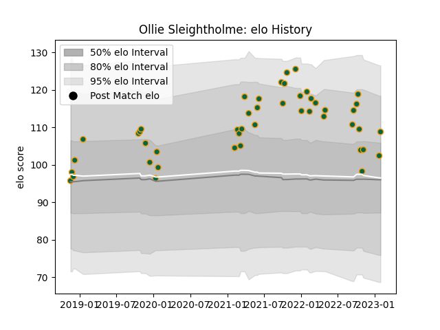

---  
layout: page  
title: Ollie Sleightholme  
date: 2023-02-02 18:56:51.893717  
categories: player  
---
# Ollie Sleightholme

## Positions: W

## Current elo: 109.0

## Current Percentile: 71.0

# Elo History

# Match History

| Team               |   Appearances |   Win Rate |
|:-------------------|--------------:|-----------:|
| Northampton Saints |            46 |   0.630435 |

| Opponent           |   Matches |   Win Rate |
|:-------------------|----------:|-----------:|
| Wasps              |         6 |   0.833333 |
| Harlequins         |         5 |   0.4      |
| Bath Rugby         |         4 |   0.5      |
| Sale Sharks        |         4 |   0.25     |
| London Irish       |         4 |   0.75     |
| Worcester Warriors |         4 |   1        |
| Exeter Chiefs      |         4 |   0.75     |
| Newcastle Falcons  |         3 |   0.333333 |
| Leicester Tigers   |         2 |   0.5      |
| Benetton Treviso   |         2 |   1        |
| Saracens           |         2 |   0.5      |
| La Rochelle        |         1 |   0        |
| Lyon               |         1 |   1        |
| Dragons            |         1 |   1        |
| Timisoara Saracens |         1 |   1        |
| Bristol Rugby      |         1 |   1        |
| Leinster           |         1 |   0        |