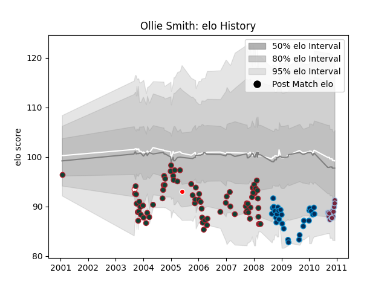

---  
layout: page  
title: Ollie Smith  
date: 2022-12-09 13:05:24.727522  
categories: player  
---
# Ollie Smith

## Positions: C, W

## Country: British and Irish Lions

## Current elo: 91.0

## Current Percentile: 21.0

# Elo History

# Match History

| Team                    |   Appearances |   Win Rate |
|:------------------------|--------------:|-----------:|
| Leicester Tigers        |            74 |   0.635135 |
| Montpellier Herault     |            29 |   0.482759 |
| Harlequins              |            14 |   0.5      |
| British and Irish Lions |             1 |   0.5      |
| England                 |             1 |   0        |

| Opponent             |   Matches |   Win Rate |
|:---------------------|----------:|-----------:|
| Newcastle Falcons    |         9 |   0.722222 |
| Leeds                |         8 |   0.75     |
| Bath Rugby           |         7 |   0.5      |
| Wasps                |         7 |   0.785714 |
| Gloucester Rugby     |         7 |   0.428571 |
| London Irish         |         7 |   0.714286 |
| Sale Sharks          |         7 |   0.142857 |
| Northampton Saints   |         6 |   0.333333 |
| Worcester Warriors   |         6 |   0.833333 |
| Saracens             |         6 |   0.583333 |
| Stade Toulousain     |         5 |   0.4      |
| Harlequins           |         4 |   1        |
| Stade Francais Paris |         3 |   0.666667 |
| Castres Olympique    |         3 |   0.666667 |
| Bristol Rugby        |         3 |   0.666667 |
| Bayonne              |         3 |   0        |
| Perpignan            |         2 |   0.5      |
| Toulon               |         2 |   0.5      |
| Leicester Tigers     |         2 |   0.5      |
| Yorkshire Carnegie   |         2 |   1        |
| Leinster             |         2 |   0.5      |
| Edinburgh            |         2 |   0.5      |
| Dax                  |         2 |   1        |
| Clermont Auvergne    |         2 |   0.5      |
| Bourgoin-Jallieu     |         2 |   0        |
| Biarritz Olympique   |         2 |   0        |
| Montauban            |         1 |   1        |
| Glasgow Warriors     |         1 |   1        |
| France               |         1 |   0        |
| Racing 92            |         1 |   1        |
| Rotherham Titans     |         1 |   1        |
| Exeter Chiefs        |         1 |   1        |
| Brive                |         1 |   0        |
| Argentina            |         1 |   0.5      |