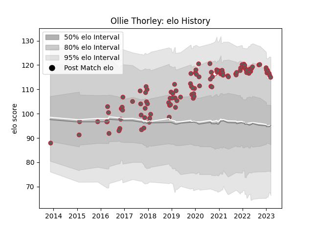

---  
layout: page  
title: Ollie Thorley  
date: 2023-02-02 19:01:51.625275  
categories: player  
---
# Ollie Thorley

## Positions: W

## Country: England

## Current elo: 108.0

## Current Percentile: 78.0

# Elo History

# Match History

| Team             |   Appearances |   Win Rate |
|:-----------------|--------------:|-----------:|
| Gloucester Rugby |           104 |   0.533654 |
| England          |             1 |   1        |

| Opponent            |   Matches |   Win Rate |
|:--------------------|----------:|-----------:|
| Exeter Chiefs       |        11 |   0.409091 |
| Wasps               |         9 |   0.777778 |
| Leicester Tigers    |         8 |   0.375    |
| Saracens            |         8 |   0.5      |
| Harlequins          |         8 |   0.25     |
| London Irish        |         8 |   0.75     |
| Bristol Rugby       |         7 |   0.285714 |
| Bath Rugby          |         6 |   0.666667 |
| Worcester Warriors  |         6 |   1        |
| Northampton Saints  |         6 |   0.166667 |
| Sale Sharks         |         5 |   0.4      |
| Newcastle Falcons   |         3 |   1        |
| Zebre               |         3 |   1        |
| Montpellier Herault |         2 |   0.5      |
| Ospreys             |         2 |   1        |
| Connacht            |         2 |   0.5      |
| Bayonne             |         1 |   1        |
| La Rochelle         |         1 |   1        |
| Munster             |         1 |   0        |
| Italy               |         1 |   1        |
| Dragons             |         1 |   0        |
| Pau                 |         1 |   0        |
| Castres Olympique   |         1 |   0        |
| Stade Toulousain    |         1 |   0        |
| Bordeaux Begles     |         1 |   1        |
| Benetton Treviso    |         1 |   1        |
| Leinster            |         1 |   0        |