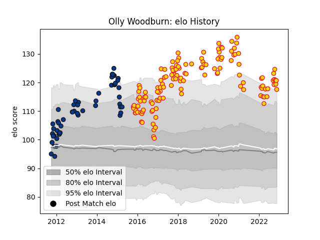

---  
layout: page  
title: Olly Woodburn  
date: 2023-02-02 19:11:14.427377  
categories: player  
---
# Olly Woodburn

## Positions: W

## Current elo: 141.0

## Current Percentile: 98.0

# Elo History

# Match History

| Team          |   Appearances |   Win Rate |
|:--------------|--------------:|-----------:|
| Exeter Chiefs |           145 |   0.686207 |
| Bath Rugby    |            53 |   0.622642 |

| Opponent            |   Matches |   Win Rate |
|:--------------------|----------:|-----------:|
| Harlequins          |        18 |   0.722222 |
| Leicester Tigers    |        16 |   0.75     |
| Wasps               |        15 |   0.5      |
| Gloucester Rugby    |        14 |   0.607143 |
| Northampton Saints  |        14 |   0.642857 |
| Saracens            |        13 |   0.307692 |
| Worcester Warriors  |        13 |   0.769231 |
| Sale Sharks         |        12 |   0.666667 |
| Newcastle Falcons   |        12 |   0.833333 |
| Bath Rugby          |        11 |   0.818182 |
| London Irish        |        10 |   0.8      |
| Bristol Rugby       |         7 |   0.714286 |
| Exeter Chiefs       |         5 |   0.6      |
| Glasgow Warriors    |         4 |   0.375    |
| Montpellier Herault |         4 |   0.75     |
| Bordeaux Begles     |         3 |   0.666667 |
| Clermont Auvergne   |         3 |   0.333333 |
| Castres Olympique   |         2 |   1        |
| Bucuresti           |         2 |   1        |
| Ulster              |         2 |   0.5      |
| Stade Toulousain    |         2 |   0.5      |
| Ospreys             |         2 |   0.5      |
| London Welsh        |         2 |   1        |
| Mogliano            |         2 |   1        |
| Leinster            |         2 |   0        |
| Bulls               |         2 |   0.5      |
| Dragons             |         2 |   1        |
| Agen                |         2 |   1        |
| La Rochelle         |         1 |   1        |
| Calvisano           |         1 |   1        |