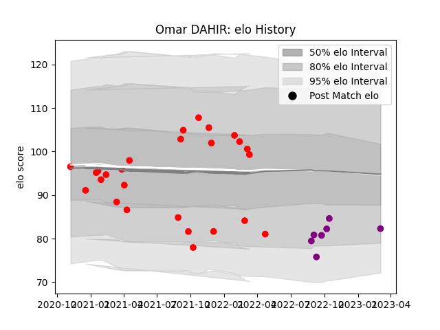

---  
layout: page  
title: Omar DAHIR  
date: 2023-03-27 11:32:20.252722  
categories: player  
---
# Omar DAHIR

Last updated: 2023-03-27
## Positions: P

## Current elo: 89.0

## Current Percentile: 15.0

# Elo History

# Match History

| Team             |   Appearances |   Win Rate |
|:-----------------|--------------:|-----------:|
| Rouen            |            26 |   0.365385 |
| Soyaux-Angouleme |             8 |   0.5      |

| Opponent                   |   Matches |   Win Rate |
|:---------------------------|----------:|-----------:|
| Aurillac                   |         4 |   0.25     |
| Grenoble                   |         4 |   0.75     |
| Nevers                     |         4 |   0        |
| Carcassonne                |         3 |   0.333333 |
| Mont-de-Marsan             |         3 |   0        |
| Oyonnax                    |         3 |   0.333333 |
| Agen                       |         2 |   0.5      |
| Beziers                    |         2 |   1        |
| Vannes                     |         2 |   0.5      |
| Colomiers                  |         1 |   0        |
| Montauban                  |         1 |   0        |
| Narbonne                   |         1 |   1        |
| Provence Rugby             |         1 |   1        |
| Soyaux-Angouleme           |         1 |   1        |
| US Bressane                |         1 |   0.5      |
| Valence Romans Drome Rugby |         1 |   0        |