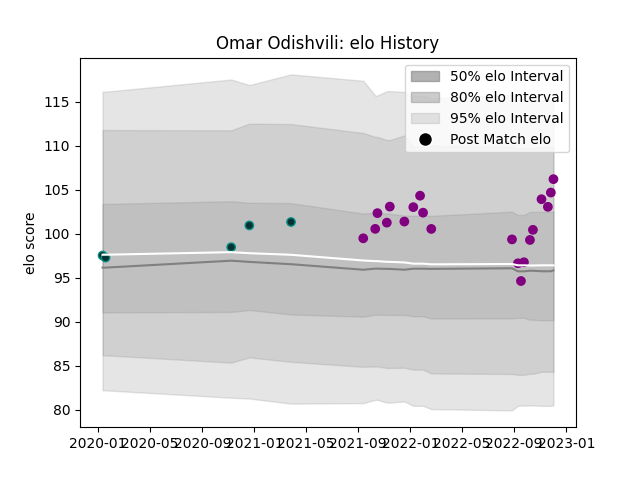

---  
layout: page  
title: Omar Odishvili  
date: 2022-12-18 16:21:22.720343  
categories: player  
---
# Omar Odishvili

## Positions: P

## Current elo: 104.0

## Current Percentile: 84.0

# Elo History

# Match History

| Team             |   Appearances |   Win Rate |
|:-----------------|--------------:|-----------:|
| Soyaux-Angouleme |            21 |   0.619048 |
| Pau              |             5 |   0.4      |

| Opponent                   |   Matches |   Win Rate |
|:---------------------------|----------:|-----------:|
| Massy                      |         2 |          1 |
| Cognac Saint Jean d'Angély |         2 |          1 |
| Agen                       |         1 |          1 |
| Valence Romans Drome Rugby |         1 |          1 |
| Tarbes                     |         1 |          1 |
| Suresnes                   |         1 |          1 |
| Racing 92                  |         1 |          0 |
| Provence Rugby             |         1 |          0 |
| Oyonnax                    |         1 |          0 |
| Nice                       |         1 |          0 |
| Montauban                  |         1 |          0 |
| Mont-de-Marsan             |         1 |          0 |
| London Irish               |         1 |          0 |
| Aurillac                   |         1 |          0 |
| Leicester Tigers           |         1 |          1 |
| Grenoble                   |         1 |          0 |
| Dijon                      |         1 |          0 |
| Dax                        |         1 |          1 |
| Castres Olympique          |         1 |          0 |
| Carcassonne                |         1 |          1 |
| Calvisano                  |         1 |          1 |
| Bourgoin-Jallieu           |         1 |          1 |
| Beziers                    |         1 |          1 |
| Vannes                     |         1 |          1 |