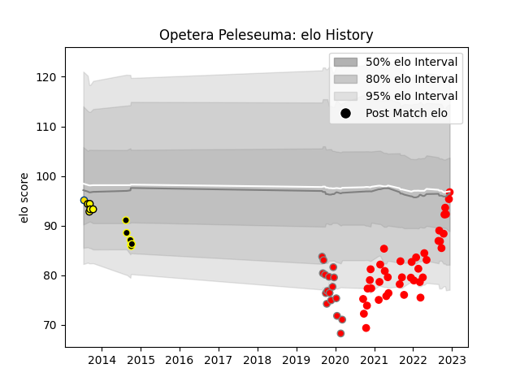

---  
layout: page  
title: Opetera Peleseuma  
date: 2023-01-13 11:38:39.900398  
categories: player  
---
# Opetera Peleseuma

## Positions: C

## Country: Samoa

## Current elo: 95.0

## Current Percentile: 10.0

# Elo History

# Match History

| Team           |   Appearances |   Win Rate |
|:---------------|--------------:|-----------:|
| Rouen          |            45 |   0.388889 |
| Roval Drome XV |            17 |   0.176471 |
| Wellington     |             6 |   0.166667 |
| Taranaki       |             5 |   0.2      |
| Hurricanes     |             1 |   0        |
| Samoa          |             1 |   1        |

| Opponent                   |   Matches |   Win Rate |
|:---------------------------|----------:|-----------:|
| Provence Rugby             |         6 |   0.25     |
| Beziers                    |         6 |   0.5      |
| Montauban                  |         5 |   0.2      |
| Mont-de-Marsan             |         5 |   0.4      |
| Grenoble                   |         4 |   0.25     |
| Vannes                     |         4 |   0.5      |
| Biarritz Olympique         |         4 |   0.25     |
| Colomiers                  |         4 |   0.25     |
| Perpignan                  |         3 |   0.333333 |
| Oyonnax                    |         3 |   0.333333 |
| Agen                       |         3 |   0        |
| Carcassonne                |         3 |   0        |
| Soyaux-Angouleme           |         2 |   1        |
| Waikato                    |         2 |   0        |
| Counties Manukau           |         2 |   0        |
| Aurillac                   |         2 |   0.5      |
| Narbonne                   |         2 |   0.5      |
| Hawke's Bay                |         2 |   0.5      |
| Rouen                      |         2 |   0        |
| Crusaders                  |         1 |   0        |
| Valence Romans Drome Rugby |         1 |   1        |
| US Bressane                |         1 |   0        |
| Taranaki                   |         1 |   0        |
| Canada                     |         1 |   1        |
| Bayonne                    |         1 |   0        |
| Northland                  |         1 |   0        |
| North Harbour              |         1 |   1        |
| Auckland                   |         1 |   0        |
| Massy                      |         1 |   1        |
| Wellington                 |         1 |   0        |