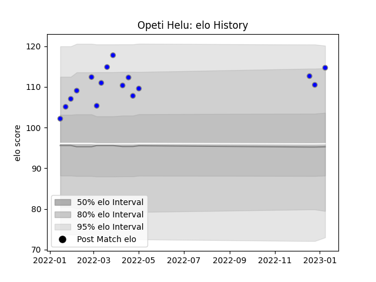

---  
layout: page  
title: Opeti Helu  
date: 2023-01-13 11:29:12.112510  
categories: player  
---
# Opeti Helu

## Positions: P

## Current elo: 115.0

## Current Percentile: 82.0

# Elo History

# Match History

| Team                              |   Appearances |   Win Rate |
|:----------------------------------|--------------:|-----------:|
| Kubota Spears Funabashi Tokyo-Bay |            16 |    0.78125 |

| Opponent                        |   Matches |   Win Rate |
|:--------------------------------|----------:|-----------:|
| Yokohama Canon Eagles           |         3 |        0.5 |
| Green Rockets Tokatsu           |         2 |        1   |
| Kobelco Kobe Steelers           |         2 |        0.5 |
| Tokyo Sungoliath                |         2 |        0.5 |
| Urayasu D-Rocks                 |         2 |        1   |
| Hanazono Kintetsu Liners        |         1 |        1   |
| NTT Docomo Red Hurricanes Osaka |         1 |        1   |
| Shizuoka Blue Revs              |         1 |        1   |
| Toshiba Brave Lupus Tokyo       |         1 |        1   |
| Toyota Verblitz                 |         1 |        1   |