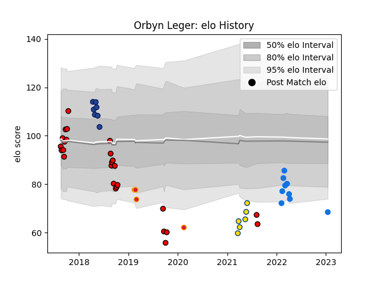

---  
layout: page  
title: Orbyn Leger  
date: 2023-01-15 11:42:12.139888  
categories: player  
---
# Orbyn Leger

## Positions: C, FH

## Current elo: 69.0

## Current Percentile: 7.0

# Elo History

# Match History

| Team                |   Appearances |   Win Rate |
|:--------------------|--------------:|-----------:|
| Counties Manukau    |            26 |   0.288462 |
| Shimizu Blue Sharks |             9 |   0.555556 |
| Blues               |             7 |   0.285714 |
| Hurricanes          |             6 |   0.666667 |
| Chiefs              |             4 |   0.25     |

| Opponent                         |   Matches |   Win Rate |
|:---------------------------------|----------:|-----------:|
| Auckland                         |         3 |   0.333333 |
| Hawke's Bay                      |         3 |   0.666667 |
| Manawatu                         |         3 |   0.333333 |
| Sunwolves                        |         3 |   0.666667 |
| North Harbour                    |         3 |   0        |
| Highlanders                      |         3 |   0.333333 |
| Chugoku Red Regulions            |         2 |   1        |
| Tasman                           |         2 |   0.5      |
| Toyota Industries Shuttles Aichi |         2 |   0        |
| Canterbury                       |         2 |   0        |
| Taranaki                         |         2 |   0        |
| Southland                        |         2 |   0.5      |
| Northland                        |         2 |   0.5      |
| Bay of Plenty                    |         2 |   0.25     |
| Melbourne Rebels                 |         2 |   0.5      |
| Munakata Sanix Blues             |         2 |   0.5      |
| New South Wales Waratahs         |         2 |   1        |
| Waikato                          |         1 |   0        |
| Wellington                       |         1 |   0        |
| Kyuden Voltex                    |         1 |   1        |
| Kurita Water Gush                |         1 |   1        |
| Kamaishi Seawaves                |         1 |   0        |
| Jaguares                         |         1 |   0        |
| Hurricanes                       |         1 |   0        |
| Crusaders                        |         1 |   0        |
| Chiefs                           |         1 |   0        |
| Brumbies                         |         1 |   0        |
| Blues                            |         1 |   0        |
| Western Force                    |         1 |   1        |