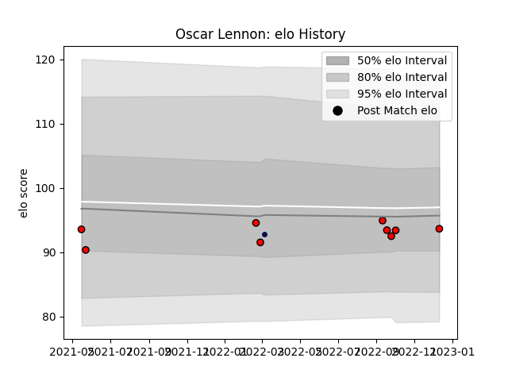

---  
layout: page  
title: Oscar Lennon  
date: 2023-01-13 11:31:58.806838  
categories: player  
---
# Oscar Lennon

## Positions: SH

## Current elo: 95.0

## Current Percentile: 28.0

# Elo History

# Match History

| Team             |   Appearances |   Win Rate |
|:-----------------|--------------:|-----------:|
| Hartpury College |            16 |      0.375 |
| Bristol Rugby    |             1 |      0     |

| Opponent            |   Matches |   Win Rate |
|:--------------------|----------:|-----------:|
| Ealing Trailfinders |         3 |        0   |
| Cornish Pirates     |         2 |        0.5 |
| Coventry            |         2 |        1   |
| Doncaster           |         2 |        0   |
| London Scottish     |         2 |        1   |
| Ampthill            |         1 |        0   |
| Bath Rugby          |         1 |        0   |
| Bedford             |         1 |        0   |
| Caldy               |         1 |        1   |
| Jersey              |         1 |        0   |
| Richmond            |         1 |        0   |