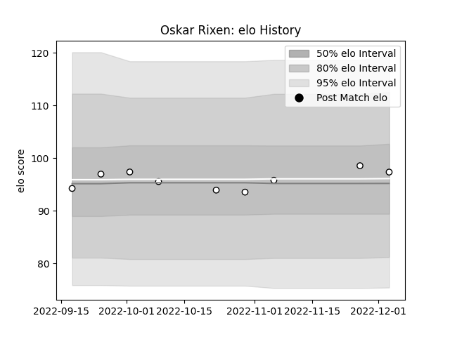

---  
layout: page  
title: Oskar Rixen  
date: 2022-12-12 15:09:01.675304  
categories: player  
---
# Oskar Rixen

## Positions: L

## Current elo: 97.0

## Current Percentile: 62.0

# Elo History

# Match History

| Team   |   Appearances |   Win Rate |
|:-------|--------------:|-----------:|
| Brive  |             9 |   0.111111 |

| Opponent             |   Matches |   Win Rate |
|:---------------------|----------:|-----------:|
| Bayonne              |         1 |          1 |
| Bordeaux Begles      |         1 |          0 |
| Castres Olympique    |         1 |          0 |
| La Rochelle          |         1 |          0 |
| Montpellier Herault  |         1 |          0 |
| Pau                  |         1 |          0 |
| Racing 92            |         1 |          0 |
| Stade Francais Paris |         1 |          0 |
| Toulon               |         1 |          0 |