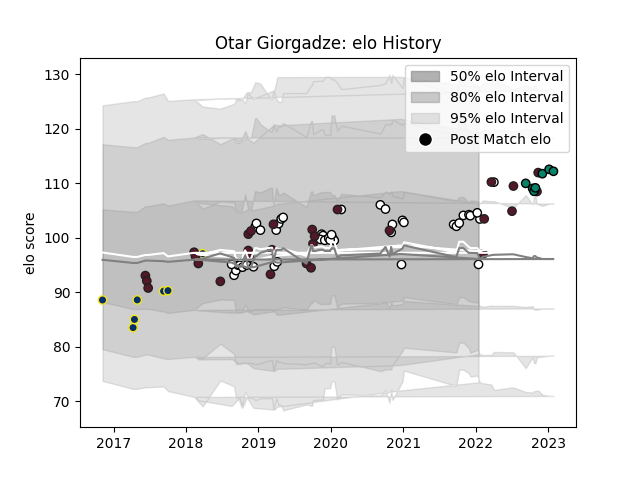

---  
layout: page  
title: Otar Giorgadze  
date: 2022-11-15 23:35:58.909220  
categories: player  
---
# Otar Giorgadze

## Positions: N8, FL

## Country: Georgia

## Current elo: 105.0

## Current Percentile: 72.0

# Elo History

# Match History

| Team              |   Appearances |   Win Rate |
|:------------------|--------------:|-----------:|
| Brive             |            38 |   0.473684 |
| Georgia           |            26 |   0.557692 |
| Clermont Auvergne |             7 |   0.428571 |
| Montauban         |             4 |   0.25     |

| Opponent                 |   Matches |   Win Rate |
|:-------------------------|----------:|-----------:|
| Stade Francais Paris     |         4 |   0.75     |
| Italy                    |         3 |   0.333333 |
| Grenoble                 |         3 |   0.666667 |
| Bayonne                  |         3 |   0.833333 |
| Lyon                     |         3 |   0.666667 |
| Castres Olympique        |         3 |   0        |
| Toulon                   |         3 |   0        |
| Samoa                    |         2 |   0.5      |
| Scotland                 |         2 |   0        |
| Argentina                |         2 |   0        |
| Clermont Auvergne        |         2 |   0        |
| Agen                     |         2 |   0.5      |
| Bristol Rugby            |         2 |   0        |
| Bordeaux Begles          |         2 |   0        |
| Biarritz Olympique       |         2 |   0.75     |
| Uruguay                  |         2 |   1        |
| Belgium                  |         2 |   1        |
| Montpellier Herault      |         2 |   0        |
| Soyaux-Angouleme         |         1 |   1        |
| Russia                   |         1 |   1        |
| Romania                  |         1 |   1        |
| Tonga                    |         1 |   1        |
| Spain                    |         1 |   1        |
| Stade Toulousain         |         1 |   0        |
| Provence Rugby           |         1 |   0        |
| US Bressane              |         1 |   1        |
| United States of America |         1 |   1        |
| Vannes                   |         1 |   1        |
| Wales                    |         1 |   0        |
| Racing 92                |         1 |   0        |
| Mont-de-Marsan           |         1 |   1        |
| Portugal                 |         1 |   0.5      |
| Pau                      |         1 |   1        |
| Aurillac                 |         1 |   0        |
| Australia                |         1 |   0        |
| Beziers                  |         1 |   1        |
| Brive                    |         1 |   0        |
| Canada                   |         1 |   1        |
| Carcassonne              |         1 |   1        |
| Colomiers                |         1 |   0        |
| Edinburgh                |         1 |   0        |
| Fiji                     |         1 |   0        |
| Germany                  |         1 |   1        |
| Japan                    |         1 |   0        |
| La Rochelle              |         1 |   0        |
| Montauban                |         1 |   1        |
| Netherlands              |         1 |   1        |
| Oyonnax                  |         1 |   1        |
| Zebre                    |         1 |   1        |