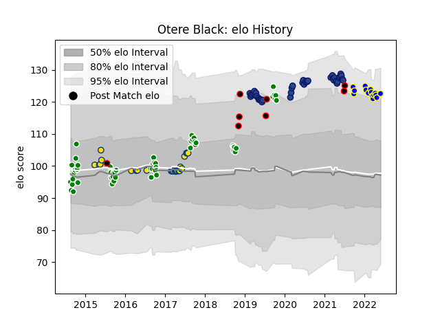

---  
layout: page  
title: Otere Black  
date: 2023-03-21 18:41:39.944808  
categories: player  
---
# Otere Black

Last updated: 2023-03-21
## Positions: FH

## Country: New Zealand Maori

## Current elo: 123.0

## Current Percentile: 90.0

# Elo History

# Match History

| Team              |   Appearances |   Win Rate |
|:------------------|--------------:|-----------:|
| Manawatu          |            53 |   0.490566 |
| Blues             |            41 |   0.597561 |
| Hurricanes        |            27 |   0.759259 |
| Urayasu D-Rocks   |            12 |   0.333333 |
| New Zealand Maori |             8 |   0.875    |
| Bay of Plenty     |             3 |   0.333333 |

| Opponent                          |   Matches |   Win Rate |
|:----------------------------------|----------:|-----------:|
| Chiefs                            |         9 |   0.555556 |
| Crusaders                         |         9 |   0.222222 |
| Highlanders                       |         8 |   0.75     |
| Southland                         |         7 |   0.857143 |
| Hurricanes                        |         7 |   0.571429 |
| Wellington                        |         6 |   0.666667 |
| Bay of Plenty                     |         6 |   0.333333 |
| Hawke's Bay                       |         6 |   0.5      |
| Northland                         |         5 |   0.8      |
| Brumbies                          |         5 |   0.6      |
| Counties Manukau                  |         4 |   0.5      |
| North Harbour                     |         4 |   0.25     |
| Melbourne Rebels                  |         4 |   1        |
| Taranaki                          |         4 |   0        |
| Otago                             |         3 |   0.333333 |
| Stormers                          |         3 |   1        |
| Canterbury                        |         3 |   0.666667 |
| Bulls                             |         3 |   0.833333 |
| Tasman                            |         3 |   0.333333 |
| Waikato                           |         3 |   0.333333 |
| Queensland Reds                   |         3 |   0.666667 |
| New South Wales Waratahs          |         3 |   1        |
| Fiji                              |         3 |   0.666667 |
| Sunwolves                         |         2 |   1        |
| Sharks                            |         2 |   0.5      |
| Samoa                             |         2 |   1        |
| Saitama Wild Knights              |         2 |   0        |
| Western Force                     |         2 |   1        |
| Auckland                          |         2 |   0        |
| Blues                             |         2 |   1        |
| Jaguares                          |         2 |   0.5      |
| Lions                             |         2 |   0.5      |
| Mitsubishi Dynaboars              |         1 |   0        |
| Tokyo Sungoliath                  |         1 |   0        |
| Black Rams Tokyo                  |         1 |   1        |
| Brazil                            |         1 |   1        |
| United States of America          |         1 |   1        |
| Toyota Verblitz                   |         1 |   0        |
| Toshiba Brave Lupus Tokyo         |         1 |   1        |
| British and Irish Lions           |         1 |   0.5      |
| Cheetahs                          |         1 |   1        |
| Chile                             |         1 |   1        |
| Green Rockets Tokatsu             |         1 |   1        |
| Shizuoka Blue Revs                |         1 |   0        |
| Kobelco Kobe Steelers             |         1 |   1        |
| Kubota Spears Funabashi Tokyo-Bay |         1 |   0        |
| Yokohama Canon Eagles             |         1 |   0        |