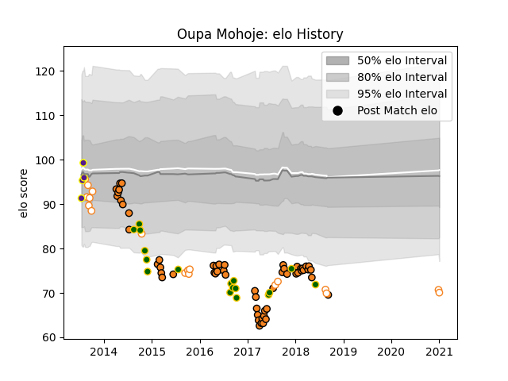

---  
layout: page  
title: Oupa Mohoje  
date: 2022-12-14 11:16:48.806352  
categories: player  
---
# Oupa Mohoje

## Positions: FL

## Country: South Africa

## Current elo: 70.0

## Current Percentile: 1.0

# Elo History

# Match History

| Team                |   Appearances |   Win Rate |
|:--------------------|--------------:|-----------:|
| Cheetahs            |            56 |   0.401786 |
| Free State Cheetahs |            18 |   0.444444 |
| South Africa        |            17 |   0.470588 |
| Griffons            |             4 |   0.25     |

| Opponent                 |   Matches |   Win Rate |
|:-------------------------|----------:|-----------:|
| Sharks                   |         6 |   0.333333 |
| Bulls                    |         6 |   0.333333 |
| Southern Kings           |         5 |   1        |
| Western Province         |         4 |   0.25     |
| Australia                |         4 |   0.5      |
| Golden Lions             |         4 |   0.5      |
| Stormers                 |         4 |   0.25     |
| Argentina                |         3 |   0.666667 |
| Crusaders                |         3 |   0        |
| New Zealand              |         3 |   0.333333 |
| Natal Sharks             |         3 |   0.5      |
| Sunwolves                |         3 |   1        |
| Blue Bulls               |         3 |   0.333333 |
| Wales                    |         3 |   0        |
| Chiefs                   |         2 |   0.25     |
| Munster                  |         2 |   0        |
| Lions                    |         2 |   0        |
| Ospreys                  |         2 |   0.5      |
| Pumas                    |         2 |   0.25     |
| Blues                    |         2 |   0.5      |
| France                   |         2 |   1        |
| Western Force            |         2 |   0.5      |
| Griquas                  |         2 |   1        |
| Glasgow Warriors         |         2 |   0        |
| Cardiff Blues            |         2 |   0.5      |
| Queensland Reds          |         1 |   0        |
| Scarlets                 |         1 |   0        |
| New South Wales Waratahs |         1 |   0        |
| SWD Eagles               |         1 |   0        |
| Jaguares                 |         1 |   0        |
| Melbourne Rebels         |         1 |   0        |
| Leopards                 |         1 |   1        |
| Leinster                 |         1 |   1        |
| Italy                    |         1 |   1        |
| Ireland                  |         1 |   0        |
| Hurricanes               |         1 |   0        |
| Highlanders              |         1 |   0        |
| Eastern Province Kings   |         1 |   0        |
| Dragons                  |         1 |   1        |
| Connacht                 |         1 |   1        |
| Brumbies                 |         1 |   1        |
| Border Bulldogs          |         1 |   0        |
| Benetton Treviso         |         1 |   0        |
| Zebre                    |         1 |   1        |