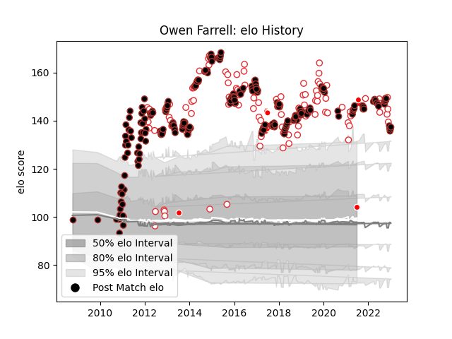

---  
layout: page  
title: Owen Farrell  
date: 2022-12-18 16:39:05.605141  
categories: player  
---
# Owen Farrell

## Positions: FH, C

## Country: England

## Current elo: 133.0

## Current Percentile: 98.0

# Elo History

# Match History

| Team                    |   Appearances |   Win Rate |
|:------------------------|--------------:|-----------:|
| Saracens                |           226 |   0.807522 |
| England                 |            90 |   0.688889 |
| British and Irish Lions |             8 |   0.5625   |

| Opponent                 |   Matches |   Win Rate |
|:-------------------------|----------:|-----------:|
| Northampton Saints       |        18 |   0.694444 |
| Harlequins               |        18 |   0.833333 |
| Bath Rugby               |        16 |   0.9375   |
| Exeter Chiefs            |        15 |   0.666667 |
| Wasps                    |        14 |   0.857143 |
| Gloucester Rugby         |        14 |   0.75     |
| Australia                |        13 |   0.846154 |
| Leicester Tigers         |        13 |   0.730769 |
| Sale Sharks              |        12 |   0.833333 |
| Wales                    |        11 |   0.454545 |
| South Africa             |        11 |   0.363636 |
| Ireland                  |        10 |   0.7      |
| France                   |        10 |   0.7      |
| Newcastle Falcons        |        10 |   1        |
| New Zealand              |        10 |   0.4      |
| Italy                    |         9 |   1        |
| Scotland                 |         9 |   0.722222 |
| Clermont Auvergne        |         9 |   0.333333 |
| Worcester Warriors       |         8 |   1        |
| London Irish             |         8 |   1        |
| Munster                  |         7 |   0.714286 |
| Racing 92                |         6 |   0.833333 |
| Stade Toulousain         |         4 |   0.5      |
| Toulon                   |         4 |   0.5      |
| Ulster                   |         4 |   1        |
| Scarlets                 |         4 |   0.625    |
| Ospreys                  |         4 |   0.875    |
| Bristol Rugby            |         4 |   1        |
| Argentina                |         4 |   0.75     |
| Lyon                     |         3 |   1        |
| Edinburgh                |         3 |   1        |
| London Welsh             |         3 |   1        |
| Leinster                 |         3 |   0.333333 |
| Oyonnax                  |         2 |   1        |
| Zebre                    |         2 |   1        |
| Connacht                 |         2 |   1        |
| Japan                    |         2 |   1        |
| Benetton Treviso         |         2 |   1        |
| Glasgow Warriors         |         2 |   1        |
| Fiji                     |         2 |   1        |
| Biarritz Olympique       |         2 |   0.5      |
| Cardiff Blues            |         2 |   1        |
| Leeds                    |         1 |   1        |
| Yorkshire Carnegie       |         1 |   1        |
| Brive                    |         1 |   1        |
| Uruguay                  |         1 |   1        |
| United States of America |         1 |   1        |
| Coventry                 |         1 |   1        |
| Tonga                    |         1 |   1        |
| Nottingham               |         1 |   1        |
| Crusaders                |         1 |   1        |
| Doncaster                |         1 |   1        |
| Ealing Trailfinders      |         1 |   1        |
| Samoa                    |         1 |   1        |
| Provincial Union XV      |         1 |   1        |
| Highlanders              |         1 |   0        |
| Ampthill                 |         1 |   1        |