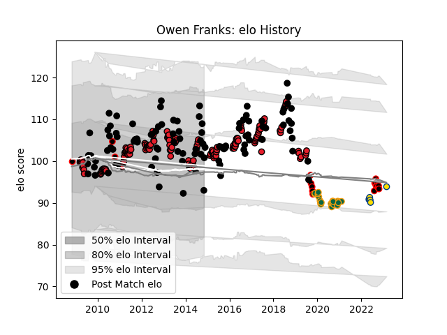

---  
layout: page  
title: Owen Franks  
date: 2023-03-02 11:24:04.551934  
categories: player  
---
# Owen Franks

## Positions: P

## Country: New Zealand

## Current elo: 93.0

## Current Percentile: 70.0

# Elo History

# Match History

| Team               |   Appearances |   Win Rate |
|:-------------------|--------------:|-----------:|
| Crusaders          |           154 |   0.720779 |
| New Zealand        |           110 |   0.863636 |
| Northampton Saints |            23 |   0.347826 |
| Canterbury         |            18 |   0.777778 |
| Hurricanes         |             6 |   0.666667 |

| Opponent                 |   Matches |   Win Rate |
|:-------------------------|----------:|-----------:|
| Australia                |        30 |   0.833333 |
| Blues                    |        17 |   0.823529 |
| South Africa             |        17 |   0.676471 |
| Highlanders              |        16 |   0.75     |
| Chiefs                   |        15 |   0.533333 |
| Hurricanes               |        15 |   0.566667 |
| France                   |        13 |   1        |
| Argentina                |        11 |   1        |
| Queensland Reds          |        10 |   0.7      |
| Sharks                   |        10 |   0.8      |
| New South Wales Waratahs |        10 |   0.7      |
| Bulls                    |        10 |   0.5      |
| Brumbies                 |        10 |   0.9      |
| England                  |         9 |   0.888889 |
| Lions                    |         9 |   0.888889 |
| Western Force            |         9 |   0.611111 |
| Ireland                  |         9 |   0.777778 |
| Stormers                 |         8 |   0.875    |
| Wales                    |         8 |   1        |
| Melbourne Rebels         |         7 |   0.714286 |
| Cheetahs                 |         7 |   0.714286 |
| British and Irish Lions  |         4 |   0.375    |
| Wellington               |         4 |   0.5      |
| Sale Sharks              |         3 |   0        |
| Northland                |         3 |   1        |
| Exeter Chiefs            |         3 |   0        |
| Wasps                    |         3 |   0.666667 |
| Scotland                 |         2 |   1        |
| Tonga                    |         2 |   1        |
| Southern Kings           |         2 |   1        |
| North Harbour            |         2 |   1        |
| Samoa                    |         2 |   1        |
| Worcester Warriors       |         2 |   1        |
| Manawatu                 |         2 |   0.5      |
| Lyon                     |         2 |   1        |
| Bay of Plenty            |         2 |   1        |
| Benetton Treviso         |         2 |   1        |
| Bristol Rugby            |         2 |   0        |
| Counties Manukau         |         2 |   1        |
| Jaguares                 |         2 |   1        |
| Hawke's Bay              |         1 |   1        |
| Saracens                 |         1 |   0        |
| Harlequins               |         1 |   0        |
| Georgia                  |         1 |   1        |
| Fijian Drua              |         1 |   1        |
| Canada                   |         1 |   1        |
| Sunwolves                |         1 |   1        |
| Taranaki                 |         1 |   0        |
| Japan                    |         1 |   1        |
| United States of America |         1 |   1        |
| Bordeaux Begles          |         1 |   0        |
| Otago                    |         1 |   1        |
| London Irish             |         1 |   0        |
| Bath Rugby               |         1 |   0        |
| Leicester Tigers         |         1 |   0        |