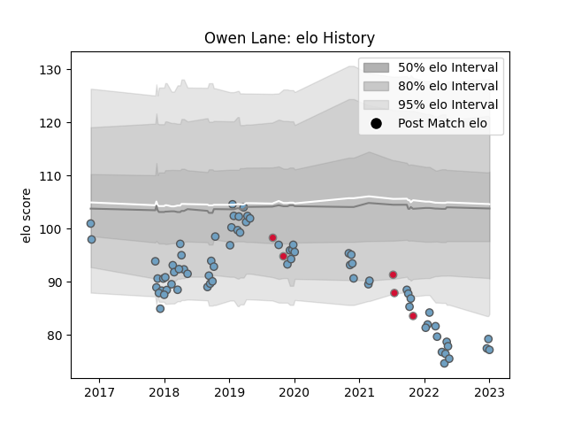

---  
layout: page  
title: Owen Lane  
date: 2022-12-18 16:31:25.049100  
categories: player  
---
# Owen Lane

## Positions: W

## Country: Wales

## Current elo: 71.0

## Current Percentile: 1.0

# Elo History

# Match History

| Team          |   Appearances |   Win Rate |
|:--------------|--------------:|-----------:|
| Cardiff Blues |            69 |   0.449275 |
| Wales         |             5 |   0.1      |

| Opponent          |   Matches |   Win Rate |
|:------------------|----------:|-----------:|
| Ospreys           |         8 |   0.125    |
| Munster           |         5 |   0.4      |
| Connacht          |         5 |   0.6      |
| Edinburgh         |         5 |   0.4      |
| Dragons           |         4 |   1        |
| Scarlets          |         4 |   0.25     |
| Glasgow Warriors  |         4 |   0        |
| Benetton Treviso  |         4 |   0.5      |
| Zebre             |         3 |   0.666667 |
| Ulster            |         3 |   0.333333 |
| Cheetahs          |         3 |   0.666667 |
| Pau               |         3 |   0.666667 |
| Leinster          |         3 |   0.333333 |
| Sale Sharks       |         2 |   0.5      |
| Newcastle Falcons |         2 |   0.5      |
| New Zealand       |         2 |   0        |
| Argentina         |         2 |   0.25     |
| Lyon              |         2 |   1        |
| Leicester Tigers  |         1 |   0        |
| Ireland           |         1 |   0        |
| Harlequins        |         1 |   0        |
| Gloucester Rugby  |         1 |   1        |
| Exeter Chiefs     |         1 |   0        |
| Sharks            |         1 |   1        |
| Southern Kings    |         1 |   1        |
| Stade Toulousain  |         1 |   1        |
| Bulls             |         1 |   0        |
| Lions             |         1 |   0        |