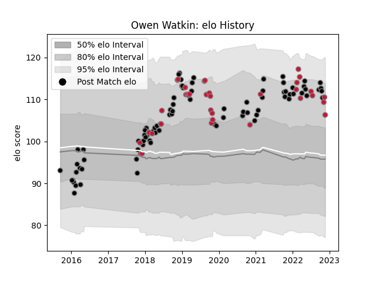

---  
layout: page  
title: Owen Watkin  
date: 2022-11-16 11:39:57.437458  
categories: player  
---
# Owen Watkin

## Positions: C

## Country: Wales

## Current elo: 112.0

## Current Percentile: 87.0

# Elo History

# Match History

| Team    |   Appearances |   Win Rate |
|:--------|--------------:|-----------:|
| Ospreys |            81 |   0.574074 |
| Wales   |            36 |   0.611111 |

| Opponent             |   Matches |   Win Rate |
|:---------------------|----------:|-----------:|
| Dragons              |        11 |   0.681818 |
| Cardiff Blues        |         8 |   0.875    |
| Scarlets             |         8 |   0.3125   |
| Ulster               |         7 |   0.285714 |
| South Africa         |         6 |   0.5      |
| Leinster             |         5 |   0.4      |
| Scotland             |         5 |   0.8      |
| England              |         5 |   0.4      |
| Glasgow Warriors     |         4 |   0.375    |
| Connacht             |         4 |   0.5      |
| Saracens             |         3 |   0.166667 |
| Munster              |         3 |   0.666667 |
| Italy                |         3 |   0.666667 |
| Ireland              |         3 |   0.333333 |
| Argentina            |         3 |   1        |
| Cheetahs             |         3 |   1        |
| Edinburgh            |         3 |   1        |
| Benetton Treviso     |         3 |   1        |
| France               |         3 |   0.666667 |
| Clermont Auvergne    |         3 |   0.333333 |
| Worcester Warriors   |         2 |   0.5      |
| Stormers             |         2 |   0.25     |
| Southern Kings       |         2 |   1        |
| Zebre                |         2 |   1        |
| Northampton Saints   |         2 |   1        |
| New Zealand          |         2 |   0        |
| Australia            |         2 |   0.5      |
| Racing 92            |         1 |   0        |
| Pau                  |         1 |   1        |
| Sharks               |         1 |   0        |
| Bulls                |         1 |   0        |
| Stade Francais Paris |         1 |   1        |
| Exeter Chiefs        |         1 |   0        |
| Tonga                |         1 |   1        |
| Uruguay              |         1 |   1        |
| Fiji                 |         1 |   1        |
| Georgia              |         1 |   1        |