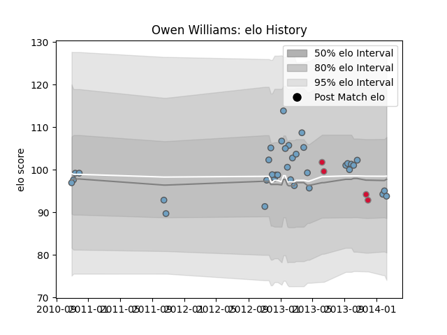

---  
layout: page  
title: Owen Williams  
date: 2022-12-14 11:13:13.642396  
categories: player  
---
# Owen Williams

## Positions: C, W

## Country: Wales

## Current elo: 104.0

## Current Percentile: None

# Elo History

# Match History

| Team          |   Appearances |   Win Rate |
|:--------------|--------------:|-----------:|
| Cardiff Blues |            36 |      0.375 |
| Wales         |             4 |      0.5   |

| Opponent            |   Matches |   Win Rate |
|:--------------------|----------:|-----------:|
| Scarlets            |         4 |   0        |
| Zebre               |         3 |   0.666667 |
| Glasgow Warriors    |         3 |   0.333333 |
| Munster             |         3 |   0.333333 |
| Bath Rugby          |         2 |   0        |
| Connacht            |         2 |   0.5      |
| Edinburgh           |         2 |   1        |
| Toulon              |         2 |   0.5      |
| Japan               |         2 |   0.5      |
| Leinster            |         2 |   0        |
| Montpellier Herault |         2 |   0        |
| Ospreys             |         2 |   0        |
| Sale Sharks         |         1 |   1        |
| Wasps               |         1 |   1        |
| Tonga               |         1 |   1        |
| Saracens            |         1 |   0        |
| Aironi              |         1 |   1        |
| Newcastle Falcons   |         1 |   0        |
| Australia           |         1 |   0        |
| Harlequins          |         1 |   1        |
| Exeter Chiefs       |         1 |   0.5      |
| Benetton Treviso    |         1 |   0        |
| London Irish        |         1 |   1        |