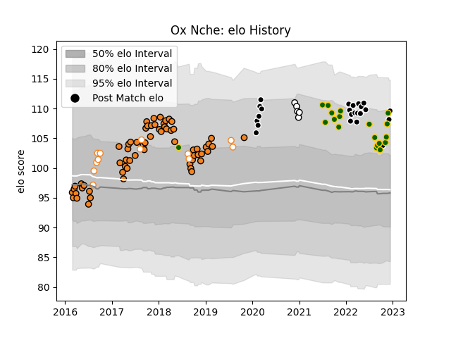

---  
layout: page  
title: Ox Nche  
date: 2022-11-16 11:36:41.464517  
categories: player  
---
# Ox Nche

## Positions: P

## Country: South Africa

## Current elo: 107.0

## Current Percentile: 81.0

# Elo History

# Match History

| Team                |   Appearances |   Win Rate |
|:--------------------|--------------:|-----------:|
| Cheetahs            |            63 |   0.373016 |
| Sharks              |            21 |   0.738095 |
| South Africa        |            17 |   0.529412 |
| Free State Cheetahs |            12 |   0.75     |
| Natal Sharks        |             5 |   0.6      |

| Opponent                 |   Matches |   Win Rate |
|:-------------------------|----------:|-----------:|
| Stormers                 |         7 |   0.214286 |
| Bulls                    |         7 |   0.428571 |
| Southern Kings           |         6 |   1        |
| Connacht                 |         6 |   0.333333 |
| Blue Bulls               |         5 |   0.8      |
| Zebre                    |         4 |   1        |
| Glasgow Warriors         |         4 |   0.25     |
| Scarlets                 |         4 |   0.5      |
| Cardiff Blues            |         4 |   0.5      |
| Munster                  |         4 |   0        |
| Lions                    |         4 |   0.5      |
| Wales                    |         3 |   0.666667 |
| Ulster                   |         3 |   0.166667 |
| Ospreys                  |         3 |   0.333333 |
| Australia                |         3 |   0.333333 |
| Golden Lions             |         3 |   0.333333 |
| Argentina                |         3 |   1        |
| Edinburgh                |         3 |   0.333333 |
| Benetton Treviso         |         3 |   0.666667 |
| Hurricanes               |         2 |   0        |
| Leinster                 |         2 |   1        |
| New Zealand              |         2 |   0.5      |
| Sharks                   |         2 |   0        |
| Sunwolves                |         2 |   1        |
| Dragons                  |         2 |   1        |
| Jaguares                 |         2 |   0.5      |
| Highlanders              |         2 |   0.5      |
| Griquas                  |         2 |   1        |
| Pumas                    |         2 |   1        |
| Brumbies                 |         1 |   0        |
| Blues                    |         1 |   0        |
| Boland Cavaliers         |         1 |   1        |
| British and Irish Lions  |         1 |   0        |
| Western Force            |         1 |   1        |
| Western Province         |         1 |   0        |
| Scotland                 |         1 |   1        |
| France                   |         1 |   0        |
| Queensland Reds          |         1 |   1        |
| Chiefs                   |         1 |   0        |
| Free State Cheetahs      |         1 |   0        |
| Natal Sharks             |         1 |   1        |
| Crusaders                |         1 |   0        |
| Melbourne Rebels         |         1 |   1        |
| Ireland                  |         1 |   0        |
| Eastern Province Kings   |         1 |   1        |
| England                  |         1 |   0        |
| Georgia                  |         1 |   1        |
| New South Wales Waratahs |         1 |   0        |