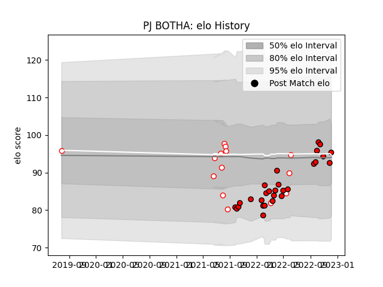

---  
layout: page  
title: PJ BOTHA  
date: 2023-03-09 10:08:16.037388  
categories: player  
---
# PJ BOTHA

## Positions: H

## Current elo: 95.0

## Current Percentile: 43.0

# Elo History

# Match History

| Team         |   Appearances |   Win Rate |
|:-------------|--------------:|-----------:|
| Lions        |            28 |   0.464286 |
| Golden Lions |            14 |   0.392857 |

| Opponent            |   Matches |   Win Rate |
|:--------------------|----------:|-----------:|
| Bulls               |         5 |   0        |
| Western Province    |         3 |   1        |
| Blue Bulls          |         3 |   0        |
| Stormers            |         3 |   0.333333 |
| Sharks              |         2 |   0        |
| Cardiff Blues       |         2 |   1        |
| Dragons             |         2 |   1        |
| Edinburgh           |         2 |   1        |
| Free State Cheetahs |         2 |   0.25     |
| Ulster              |         2 |   0        |
| Griquas             |         2 |   0.5      |
| Natal Sharks        |         2 |   0.5      |
| Ospreys             |         2 |   1        |
| Pumas               |         2 |   0        |
| Scarlets            |         2 |   0.5      |
| Benetton Treviso    |         1 |   1        |
| Leinster            |         1 |   0        |
| Munster             |         1 |   1        |
| Glasgow Warriors    |         1 |   0        |
| Connacht            |         1 |   0        |
| Zebre               |         1 |   1        |