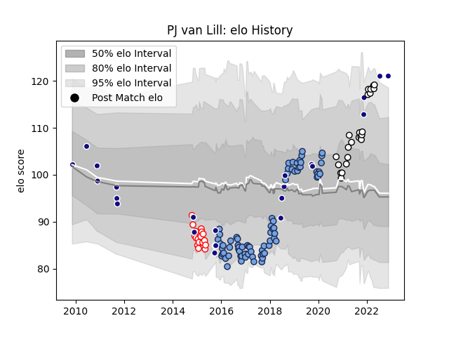

---  
layout: page  
title: PJ van Lill  
date: 2022-11-22 11:34:00.588500  
categories: player  
---
# PJ van Lill

## Positions: N8, L

## Country: Namibia

## Current elo: 121.0

## Current Percentile: 96.0

# Elo History

# Match History

| Team                       |   Appearances |   Win Rate |
|:---------------------------|--------------:|-----------:|
| Bayonne                    |            76 |   0.434211 |
| Namibia                    |            24 |   0.416667 |
| Valence Romans Drome Rugby |            23 |   0.673913 |
| Dax                        |            17 |   0.323529 |

| Opponent                   |   Matches |   Win Rate |
|:---------------------------|----------:|-----------:|
| Aurillac                   |         7 |   0.714286 |
| Montauban                  |         6 |   0.666667 |
| Mont-de-Marsan             |         6 |   0.5      |
| Carcassonne                |         6 |   0.5      |
| Colomiers                  |         5 |   0.3      |
| Biarritz Olympique         |         5 |   0.4      |
| Vannes                     |         4 |   0.25     |
| Beziers                    |         4 |   0.75     |
| Brive                      |         4 |   0.375    |
| Lyon                       |         4 |   0.125    |
| La Rochelle                |         4 |   0        |
| Dax                        |         4 |   0.875    |
| Portugal                   |         3 |   0.333333 |
| Pau                        |         3 |   0.166667 |
| Montpellier Herault        |         3 |   0        |
| Massy                      |         3 |   1        |
| Agen                       |         3 |   0.333333 |
| Zimbabwe                   |         3 |   1        |
| Nevers                     |         2 |   0.5      |
| Tarbes                     |         2 |   0        |
| Suresnes                   |         2 |   1        |
| Stade Toulousain           |         2 |   0.5      |
| Spain                      |         2 |   0        |
| Soyaux-Angouleme           |         2 |   0        |
| Scarlets                   |         2 |   0        |
| Racing 92                  |         2 |   0        |
| Provence Rugby             |         2 |   0.5      |
| Aubenas                    |         2 |   1        |
| Perpignan                  |         2 |   0        |
| Clermont Auvergne          |         2 |   0.5      |
| Oyonnax                    |         2 |   0        |
| Nice                       |         2 |   1        |
| New Zealand                |         2 |   0        |
| Cognac Saint Jean d'Angély |         2 |   1        |
| Narbonne                   |         2 |   0.5      |
| Grenoble                   |         2 |   0        |
| Albi                       |         2 |   0.5      |
| Canada                     |         2 |   0.5      |
| Kenya                      |         2 |   1        |
| Argentina                  |         1 |   0        |
| Uganda                     |         1 |   1        |
| US Bressane                |         1 |   1        |
| Toulon                     |         1 |   1        |
| Tonga                      |         1 |   0        |
| Dijon                      |         1 |   1        |
| Fiji                       |         1 |   0        |
| Georgia                    |         1 |   0        |
| Stade Francais Paris       |         1 |   1        |
| South Africa               |         1 |   0        |
| Italy                      |         1 |   0        |
| Morocco                    |         1 |   1        |
| Scotland A                 |         1 |   1        |
| Samoa                      |         1 |   0        |
| Rouen                      |         1 |   0        |
| Chambery                   |         1 |   1        |
| London Irish               |         1 |   1        |
| Castres Olympique          |         1 |   0        |
| Bourgoin-Jallieu           |         1 |   0.5      |
| Bordeaux Begles            |         1 |   0        |
| Blagnac                    |         1 |   1        |