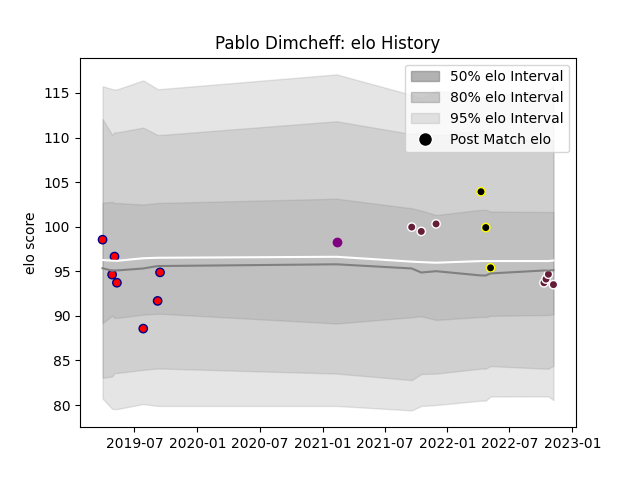

---  
layout: page  
title: Pablo Dimcheff  
date: 2022-11-15 23:40:46.023609  
categories: player  
---
# Pablo Dimcheff

## Positions: H

## Current elo: 94.0

## Current Percentile: 44.0

# Elo History

# Match History

| Team             |   Appearances |   Win Rate |
|:-----------------|--------------:|-----------:|
| Bordeaux Begles  |             7 |   0.571429 |
| Pucara           |             7 |   0.714286 |
| Mont-de-Marsan   |             3 |   0.666667 |
| Soyaux-Angouleme |             1 |   0        |

| Opponent             |   Matches |   Win Rate |
|:---------------------|----------:|-----------:|
| Pau                  |         2 |        0.5 |
| Racing 92            |         2 |        1   |
| Alumni               |         1 |        0   |
| Atletico del Rosario |         1 |        1   |
| Aurillac             |         1 |        1   |
| CUBA                 |         1 |        1   |
| Castres Olympique    |         1 |        0.5 |
| Clermont Auvergne    |         1 |        0.5 |
| Colomiers            |         1 |        0   |
| Grenoble             |         1 |        1   |
| La Plata             |         1 |        0   |
| Lyon                 |         1 |        0   |
| Newman               |         1 |        1   |
| Oyonnax              |         1 |        0   |
| Regatas Bella Vista  |         1 |        1   |
| San Luis             |         1 |        1   |