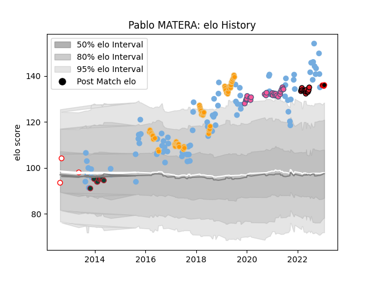

---  
layout: page  
title: Pablo MATERA  
date: 2023-01-19 11:43:39.829466  
categories: player  
---
# Pablo MATERA

## Positions: FL

## Country: Argentina

## Current elo: 136.0

## Current Percentile: 97.0

# Elo History

# Match History

| Team                 |   Appearances |   Win Rate |
|:---------------------|--------------:|-----------:|
| Argentina            |            89 |   0.286517 |
| Jaguares             |            52 |   0.480769 |
| Stade Francais Paris |            25 |   0.54     |
| Crusaders            |            14 |   0.785714 |
| Leicester Tigers     |            10 |   0.5      |
| Alumni               |             3 |   0.333333 |
| Mie Honda Heat       |             2 |   1        |

| Opponent                 |   Matches |   Win Rate |
|:-------------------------|----------:|-----------:|
| South Africa             |        18 |   0.166667 |
| New Zealand              |        16 |   0.125    |
| Australia                |        15 |   0.2      |
| Wales                    |         7 |   0.214286 |
| Sharks                   |         7 |   0.285714 |
| England                  |         7 |   0.142857 |
| Scotland                 |         6 |   0.333333 |
| Stormers                 |         6 |   0.333333 |
| Lions                    |         6 |   0.333333 |
| France                   |         5 |   0.2      |
| Bulls                    |         5 |   0.6      |
| Queensland Reds          |         5 |   0.8      |
| Chiefs                   |         5 |   0.4      |
| Ireland                  |         4 |   0.25     |
| Italy                    |         4 |   1        |
| Highlanders              |         4 |   0.5      |
| Hurricanes               |         4 |   0.5      |
| New South Wales Waratahs |         4 |   0.75     |
| Brumbies                 |         4 |   1        |
| Crusaders                |         3 |   0        |
| Melbourne Rebels         |         3 |   1        |
| Pau                      |         3 |   0.666667 |
| Blues                    |         3 |   0.666667 |
| Bayonne                  |         3 |   0.333333 |
| Southern Kings           |         2 |   0.5      |
| Montpellier Herault      |         2 |   0.75     |
| Stade Toulousain         |         2 |   0.5      |
| Agen                     |         2 |   1        |
| Tonga                    |         2 |   1        |
| La Rochelle              |         2 |   0.5      |
| Saracens                 |         2 |   0.5      |
| Harlequins               |         2 |   0        |
| Georgia                  |         2 |   1        |
| Cheetahs                 |         2 |   1        |
| Castres Olympique        |         2 |   1        |
| Brive                    |         2 |   0.5      |
| Wasps                    |         2 |   0.5      |
| Racing 92                |         2 |   0.5      |
| Sunwolves                |         1 |   0        |
| Toulon                   |         1 |   0        |
| United States of America |         1 |   1        |
| Western Force            |         1 |   1        |
| Lyon                     |         1 |   1        |
| Romania                  |         1 |   1        |
| Olivos                   |         1 |   1        |
| Northampton Saints       |         1 |   1        |
| Newcastle Falcons        |         1 |   1        |
| Namibia                  |         1 |   1        |
| Moana Pasifika           |         1 |   1        |
| Kamaishi Seawaves        |         1 |   1        |
| Hino Red Dolphins        |         1 |   1        |
| Hindu                    |         1 |   0        |
| Clermont Auvergne        |         1 |   0        |
| CUBA                     |         1 |   0        |
| Bristol Rugby            |         1 |   0        |
| Bordeaux Begles          |         1 |   0        |
| Bath Rugby               |         1 |   0        |
| Worcester Warriors       |         1 |   1        |