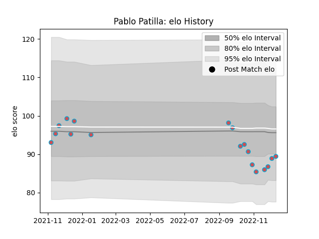

---  
layout: page  
title: Pablo Patilla  
date: 2022-12-14 11:16:09.236323  
categories: player  
---
# Pablo Patilla

## Positions: W, C

## Current elo: 89.0

## Current Percentile: 21.0

# Elo History

# Match History

| Team             |   Appearances |   Win Rate |
|:-----------------|--------------:|-----------:|
| Bourgoin-Jallieu |            18 |   0.416667 |

| Opponent                   |   Matches |   Win Rate |
|:---------------------------|----------:|-----------:|
| Albi                       |         2 |       0    |
| Blagnac                    |         2 |       0    |
| Chambery                   |         2 |       1    |
| Suresnes                   |         2 |       0    |
| Tarbes                     |         2 |       0    |
| Valence Romans Drome Rugby |         2 |       0.75 |
| Cognac Saint Jean d'Angély |         1 |       1    |
| Dax                        |         1 |       1    |
| Nice                       |         1 |       1    |
| Rennes                     |         1 |       1    |
| Soyaux-Angouleme           |         1 |       0    |
| US Bressane                |         1 |       0    |