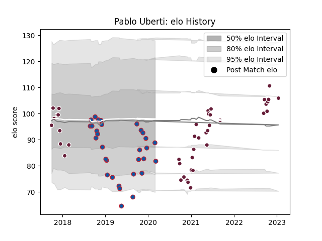

---  
layout: page  
title: Pablo Uberti  
date: 2023-01-15 11:50:44.545294  
categories: player  
---
# Pablo Uberti

## Positions: C

## Current elo: 89.0

## Current Percentile: 23.0

# Elo History

# Match History

| Team            |   Appearances |   Win Rate |
|:----------------|--------------:|-----------:|
| Bordeaux Begles |            41 |   0.573171 |
| Grenoble        |            31 |   0.33871  |

| Opponent             |   Matches |   Win Rate |
|:---------------------|----------:|-----------:|
| Agen                 |         6 |   0.75     |
| Clermont Auvergne    |         6 |   0.583333 |
| Montpellier Herault  |         5 |   0.4      |
| Toulon               |         4 |   0.5      |
| Stade Toulousain     |         4 |   0        |
| Racing 92            |         4 |   0.5      |
| Pau                  |         4 |   0.25     |
| Castres Olympique    |         3 |   0.666667 |
| Oyonnax              |         3 |   0.666667 |
| Lyon                 |         3 |   0.333333 |
| Biarritz Olympique   |         3 |   0.166667 |
| Newcastle Falcons    |         2 |   0        |
| Benetton Treviso     |         2 |   0        |
| Harlequins           |         2 |   0.5      |
| Stade Francais Paris |         2 |   1        |
| RC Enisei            |         2 |   1        |
| Bristol Rugby        |         1 |   0        |
| Beziers              |         1 |   1        |
| Soyaux-Angouleme     |         1 |   1        |
| Sharks               |         1 |   0        |
| Perpignan            |         1 |   0        |
| Bordeaux Begles      |         1 |   1        |
| Carcassonne          |         1 |   1        |
| Colomiers            |         1 |   0        |
| Nevers               |         1 |   1        |
| Brive                |         1 |   0.5      |
| Montauban            |         1 |   1        |
| Mont-de-Marsan       |         1 |   0        |
| Bayonne              |         1 |   1        |
| La Rochelle          |         1 |   0        |
| Edinburgh            |         1 |   1        |
| Dragons              |         1 |   0        |
| Vannes               |         1 |   0        |