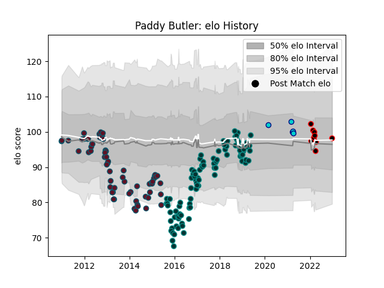

---  
layout: page  
title: Paddy Butler  
date: 2022-12-28 12:52:52.197238  
categories: player  
---
# Paddy Butler

## Positions: FL, N8

## Current elo: 98.0

## Current Percentile: 52.0

# Elo History

# Match History

| Team               |   Appearances |   Win Rate |
|:-------------------|--------------:|-----------:|
| Pau                |            92 |   0.445652 |
| Munster            |            66 |   0.659091 |
| Mie Honda Heat     |             9 |   0.777778 |
| Shizuoka Blue Revs |             5 |   0.6      |

| Opponent                        |   Matches |   Win Rate |
|:--------------------------------|----------:|-----------:|
| Racing 92                       |         8 |   0.4375   |
| Montpellier Herault             |         8 |   0.375    |
| Clermont Auvergne               |         8 |   0.125    |
| Edinburgh                       |         8 |   0.75     |
| Glasgow Warriors                |         7 |   0.428571 |
| Stade Francais Paris            |         7 |   0.571429 |
| Connacht                        |         7 |   0.857143 |
| Dragons                         |         7 |   0.714286 |
| Agen                            |         6 |   1        |
| Ulster                          |         6 |   0.666667 |
| Toulon                          |         6 |   0.333333 |
| Stade Toulousain                |         6 |   0.333333 |
| Ospreys                         |         6 |   0.416667 |
| Grenoble                        |         6 |   0.833333 |
| Zebre                           |         6 |   1        |
| Castres Olympique               |         6 |   0.333333 |
| Cardiff Blues                   |         6 |   0.666667 |
| La Rochelle                     |         5 |   0.2      |
| Bordeaux Begles                 |         5 |   0.4      |
| Scarlets                        |         5 |   0.4      |
| Brive                           |         3 |   0.333333 |
| Oyonnax                         |         3 |   0.666667 |
| Benetton Treviso                |         3 |   0.666667 |
| Lyon                            |         3 |   0.333333 |
| Kamaishi Seawaves               |         3 |   1        |
| Leinster                        |         2 |   0.5      |
| Bayonne                         |         2 |   0.75     |
| Mitsubishi Dynaboars            |         2 |   1        |
| Hanazono Kintetsu Liners        |         2 |   0        |
| Perpignan                       |         2 |   1        |
| Bristol Rugby                   |         2 |   0        |
| Skyactivs Hiroshima             |         2 |   1        |
| Sale Sharks                     |         2 |   0.5      |
| Saracens                        |         2 |   0.5      |
| Bath Rugby                      |         1 |   0        |
| Worcester Warriors              |         1 |   0        |
| Gloucester Rugby                |         1 |   1        |
| Saitama Wild Knights            |         1 |   0        |
| Green Rockets Tokatsu           |         1 |   1        |
| NTT Docomo Red Hurricanes Osaka |         1 |   1        |
| Aironi                          |         1 |   0        |
| Hino Red Dolphins               |         1 |   1        |
| Harlequins                      |         1 |   1        |
| Kobelco Kobe Steelers           |         1 |   0        |