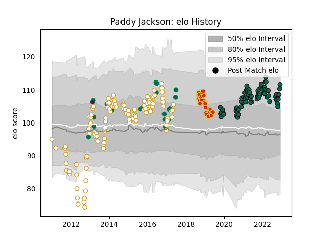

---  
layout: page  
title: Paddy Jackson  
date: 2022-11-22 11:37:44.019699  
categories: player  
---
# Paddy Jackson

## Positions: FH

## Country: Ireland

## Current elo: 109.0

## Current Percentile: 80.0

# Elo History

# Match History

| Team         |   Appearances |   Win Rate |
|:-------------|--------------:|-----------:|
| Ulster       |           123 |   0.613821 |
| London Irish |            67 |   0.38806  |
| Ireland      |            25 |   0.62     |
| Perpignan    |            25 |   0.06     |
| Munster      |             1 |   1        |

| Opponent             |   Matches |   Win Rate |
|:---------------------|----------:|-----------:|
| Leinster             |        14 |  0.357143  |
| Connacht             |        12 |  0.75      |
| Glasgow Warriors     |        12 |  0.5       |
| Cardiff Blues        |        10 |  0.75      |
| Leicester Tigers     |        10 |  0.4       |
| Munster              |         9 |  0.277778  |
| Dragons              |         9 |  0.777778  |
| Exeter Chiefs        |         8 |  0.5       |
| Scarlets             |         8 |  0.75      |
| Northampton Saints   |         7 |  0.142857  |
| Edinburgh            |         7 |  0.857143  |
| Saracens             |         7 |  0.214286  |
| Ospreys              |         6 |  0.833333  |
| Bristol Rugby        |         6 |  0.333333  |
| Bordeaux Begles      |         6 |  0.0833333 |
| Benetton Treviso     |         6 |  0.75      |
| Sale Sharks          |         6 |  0.166667  |
| Worcester Warriors   |         6 |  0.5       |
| Gloucester Rugby     |         6 |  0.25      |
| Harlequins           |         5 |  0.3       |
| Zebre                |         5 |  0.8       |
| Toulon               |         5 |  0         |
| Bath Rugby           |         5 |  0.4       |
| Wasps                |         5 |  0.5       |
| Stade Toulousain     |         4 |  0.5       |
| Clermont Auvergne    |         4 |  0.25      |
| Castres Olympique    |         4 |  0.5       |
| Newcastle Falcons    |         4 |  0.75      |
| South Africa         |         3 |  0.333333  |
| Scotland             |         3 |  0.333333  |
| Italy                |         3 |  0.666667  |
| Aironi               |         3 |  1         |
| Wales                |         3 |  0.666667  |
| Pau                  |         3 |  0.333333  |
| Oyonnax              |         2 |  1         |
| Stade Francais Paris |         2 |  0         |
| La Rochelle          |         2 |  0         |
| Montpellier Herault  |         2 |  0.5       |
| Japan                |         2 |  1         |
| Grenoble             |         2 |  0.5       |
| France               |         2 |  0.75      |
| England              |         2 |  0.5       |
| New Zealand          |         1 |  0         |
| Racing 92            |         1 |  0         |
| Romania              |         1 |  1         |
| Samoa                |         1 |  1         |
| Lyon                 |         1 |  0         |
| Fiji                 |         1 |  1         |
| Canada               |         1 |  1         |
| Bayonne              |         1 |  1         |
| Australia            |         1 |  1         |
| Argentina            |         1 |  0         |
| Agen                 |         1 |  0         |