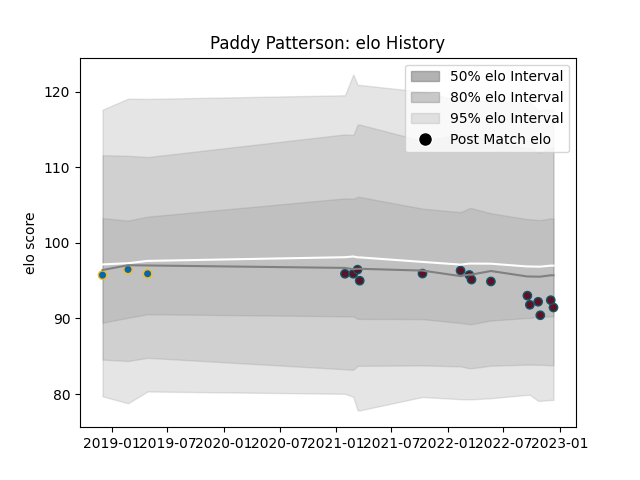

---  
layout: page  
title: Paddy Patterson  
date: 2023-01-06 00:10:20.708467  
categories: player  
---
# Paddy Patterson

## Positions: SH

## Current elo: 103.0

## Current Percentile: 30.0

# Elo History

# Match History

| Team     |   Appearances |   Win Rate |
|:---------|--------------:|-----------:|
| Munster  |            16 |   0.4375   |
| Leinster |             3 |   0.666667 |

| Opponent         |   Matches |   Win Rate |
|:-----------------|----------:|-----------:|
| Ulster           |         3 |   0.333333 |
| Benetton Treviso |         2 |   1        |
| Cardiff Blues    |         2 |   0.5      |
| Dragons          |         2 |   0.5      |
| Leinster         |         2 |   0        |
| Scarlets         |         2 |   1        |
| Bulls            |         1 |   0        |
| Edinburgh        |         1 |   1        |
| Glasgow Warriors |         1 |   0        |
| Lions            |         1 |   0        |
| Southern Kings   |         1 |   1        |
| Stade Toulousain |         1 |   0        |