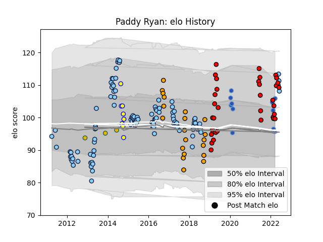

---  
layout: page  
title: Paddy Ryan  
date: 2022-12-18 16:38:24.857063  
categories: player  
---
# Paddy Ryan

## Positions: P

## Current elo: 101.0

## Current Percentile: 75.0

# Elo History

# Match History

| Team                     |   Appearances |   Win Rate |
|:-------------------------|--------------:|-----------:|
| New South Wales Waratahs |           110 |   0.531818 |
| San Diego Legion         |            32 |   0.578125 |
| NSW Country Eagles       |            20 |   0.525    |
| Munakata Sanix Blues     |             8 |   0.5      |
| Sydney Stars             |             8 |   0.1875   |

| Opponent                          |   Matches |   Win Rate |
|:----------------------------------|----------:|-----------:|
| Melbourne Rebels                  |        13 |   0.846154 |
| Brumbies                          |        13 |   0.461538 |
| Western Force                     |        11 |   0.545455 |
| Queensland Reds                   |        10 |   0.7      |
| Blues                             |         8 |   0.25     |
| Highlanders                       |         8 |   0.375    |
| Chiefs                            |         8 |   0.5      |
| Hurricanes                        |         6 |   0.333333 |
| Lions                             |         5 |   0.2      |
| Houston SaberCats                 |         5 |   0.8      |
| Seattle Seawolves                 |         5 |   0.6      |
| Crusaders                         |         5 |   0.4      |
| Sharks                            |         5 |   0.5      |
| Stormers                          |         5 |   0.8      |
| Melbourne Rising                  |         4 |   0.5      |
| Utah Warriors                     |         4 |   0.75     |
| Canberra Vikings                  |         4 |   0.625    |
| Bulls                             |         4 |   0.5      |
| Queensland Country                |         4 |   0        |
| Austin Gilgronis                  |         3 |   0        |
| Sunwolves                         |         3 |   1        |
| Greater Sydney Rams               |         3 |   0.333333 |
| Toronto Arrows                    |         3 |   0.333333 |
| Cheetahs                          |         3 |   0.666667 |
| Brisbane City                     |         3 |   0.166667 |
| Perth Spirit                      |         3 |   0.666667 |
| Southern Kings                    |         2 |   0.5      |
| Old Glory DC                      |         2 |   0.5      |
| Sydney Rays                       |         2 |   1        |
| R.U. New York                     |         2 |   0.5      |
| Austin Elite Rugby                |         2 |   1        |
| North Harbour Rays                |         2 |   1        |
| NOLA Gold                         |         2 |   1        |
| L. A. Giltinis                    |         2 |   0        |
| Kyuden Voltex                     |         2 |   1        |
| Jaguares                          |         2 |   0        |
| NTT Docomo Red Hurricanes Osaka   |         1 |   1        |
| NSW Country Eagles                |         1 |   0        |
| Shimizu Blue Sharks               |         1 |   0        |
| Kubota Spears Funabashi Tokyo-Bay |         1 |   0        |
| Green Rockets Tokatsu             |         1 |   1        |
| Glendale Raptors                  |         1 |   0.5      |
| Fijian Drua                       |         1 |   0        |
| Dallas Jackals                    |         1 |   1        |
| Black Rams Tokyo                  |         1 |   0        |
| Yokohama Canon Eagles             |         1 |   0        |