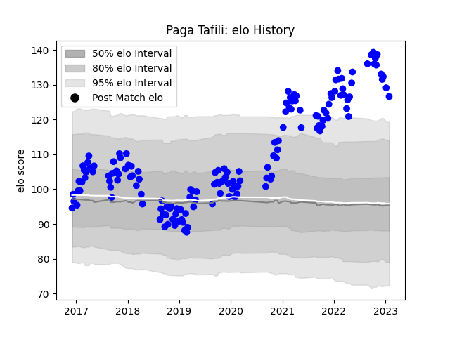

---  
layout: page  
title: Paga Tafili  
date: 2023-02-02 18:47:43.584410  
categories: player  
---
# Paga Tafili

## Positions: P

## Current elo: 127.0

## Current Percentile: 98.0

# Elo History

# Match History

| Team   |   Appearances |   Win Rate |
|:-------|--------------:|-----------:|
| Vannes |           151 |    0.52649 |

| Opponent                   |   Matches |   Win Rate |
|:---------------------------|----------:|-----------:|
| Aurillac                   |        12 |   0.583333 |
| Nevers                     |        11 |   0.5      |
| Colomiers                  |        11 |   0.727273 |
| Beziers                    |        11 |   0.636364 |
| Mont-de-Marsan             |        11 |   0.545455 |
| Montauban                  |        10 |   0.4      |
| Provence Rugby             |         9 |   0.555556 |
| Carcassonne                |         9 |   0.388889 |
| Soyaux-Angouleme           |         9 |   0.555556 |
| Oyonnax                    |         8 |   0.5      |
| Biarritz Olympique         |         7 |   0.571429 |
| Grenoble                   |         6 |   0.5      |
| Bayonne                    |         6 |   0.333333 |
| Massy                      |         5 |   0.6      |
| Rouen                      |         4 |   0.25     |
| US Bressane                |         3 |   0.833333 |
| Perpignan                  |         3 |   0        |
| Agen                       |         3 |   0.333333 |
| Narbonne                   |         3 |   1        |
| Dax                        |         3 |   0.333333 |
| Roval Drome XV             |         2 |   1        |
| Brive                      |         2 |   0        |
| Albi                       |         1 |   1        |
| Bourgoin-Jallieu           |         1 |   1        |
| Valence Romans Drome Rugby |         1 |   0        |