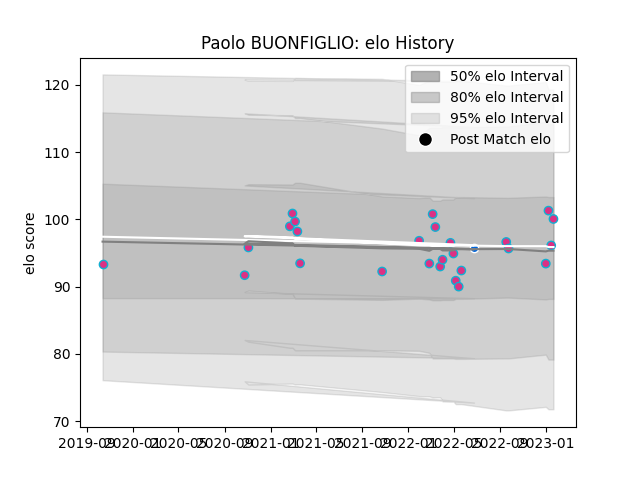

---  
layout: page  
title: Paolo BUONFIGLIO  
date: 2023-02-05 17:56:50.799941  
categories: player  
---
# Paolo BUONFIGLIO

## Positions: P

## Country: Italy

## Current elo: 100.0

## Current Percentile: 52.0

# Elo History

# Match History

| Team                |   Appearances |   Win Rate |
|:--------------------|--------------:|-----------:|
| Zebre               |            27 |   0.111111 |
| Mogliano Rugby 1969 |             4 |   0.75     |
| Italy               |             1 |   1        |

| Opponent              |   Matches |   Win Rate |
|:----------------------|----------:|-----------:|
| Ospreys               |         4 |       0.25 |
| Edinburgh             |         3 |       0    |
| Leinster              |         3 |       0    |
| Benetton Treviso      |         2 |       0    |
| Dragons               |         2 |       1    |
| Glasgow Warriors      |         2 |       0    |
| Scarlets              |         2 |       0    |
| Rugby Colorno 1975    |         1 |       1    |
| Toulon                |         1 |       0    |
| Stormers              |         1 |       0    |
| Sharks                |         1 |       0    |
| Rugby Viadana 1970    |         1 |       1    |
| Rugby Lyons Piacenza  |         1 |       0    |
| Namibia               |         1 |       1    |
| Petrarca Padova Rugby |         1 |       1    |
| Bristol Rugby         |         1 |       0    |
| Munster               |         1 |       0    |
| Connacht              |         1 |       0    |
| Cardiff Blues         |         1 |       0    |
| Bulls                 |         1 |       0    |
| Ulster                |         1 |       0    |