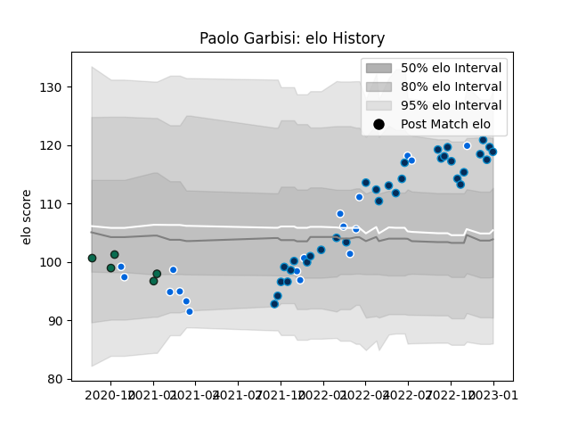

---  
layout: page  
title: Paolo Garbisi  
date: 2022-12-09 13:18:00.825974  
categories: player  
---
# Paolo Garbisi

## Positions: FH, C

## Country: Italy

## Current elo: 108.0

## Current Percentile: 84.0

# Elo History

# Match History

| Team                |   Appearances |   Win Rate |
|:--------------------|--------------:|-----------:|
| Montpellier Herault |            28 |   0.553571 |
| Italy               |            18 |   0.222222 |
| Benetton Treviso    |             5 |   0        |

| Opponent             |   Matches |   Win Rate |
|:---------------------|----------:|-----------:|
| Bordeaux Begles      |         4 |   0.5      |
| Zebre                |         3 |   0        |
| England              |         3 |   0        |
| Racing 92            |         3 |   0.666667 |
| Lyon                 |         3 |   0.333333 |
| La Rochelle          |         3 |   0.666667 |
| Ireland              |         3 |   0        |
| Clermont Auvergne    |         3 |   0        |
| France               |         2 |   0        |
| Wales                |         2 |   0.5      |
| Scotland             |         2 |   0        |
| Castres Olympique    |         2 |   1        |
| Pau                  |         2 |   0.5      |
| Perpignan            |         2 |   1        |
| Brive                |         2 |   0.75     |
| Stade Toulousain     |         2 |   0        |
| Uruguay              |         1 |   1        |
| Ulster               |         1 |   0        |
| Stade Francais Paris |         1 |   1        |
| Argentina            |         1 |   0        |
| Samoa                |         1 |   1        |
| Romania              |         1 |   1        |
| Biarritz Olympique   |         1 |   1        |
| Leinster             |         1 |   0        |
| Georgia              |         1 |   0        |
| New Zealand          |         1 |   0        |