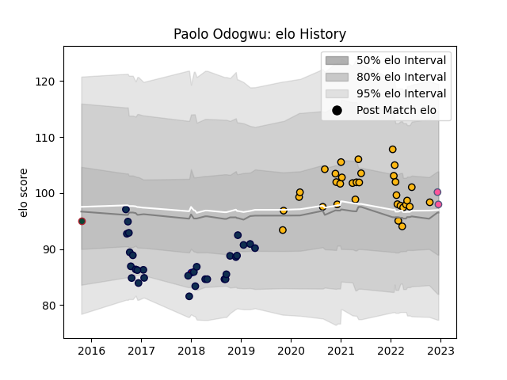

---  
layout: page  
title: Paolo Odogwu  
date: 2022-12-14 11:23:12.625218  
categories: player  
---
# Paolo Odogwu

## Positions: W, C

## Current elo: 100.0

## Current Percentile: 62.0

# Elo History

# Match History

| Team                 |   Appearances |   Win Rate |
|:---------------------|--------------:|-----------:|
| Wasps                |            33 |   0.560606 |
| Sale Sharks          |            30 |   0.433333 |
| Leicester Tigers     |             1 |   1        |
| Rotherham Titans     |             1 |   0        |
| Stade Francais Paris |             1 |   1        |

| Opponent           |   Matches |   Win Rate |
|:-------------------|----------:|-----------:|
| Bath Rugby         |         6 |   0.75     |
| Exeter Chiefs      |         6 |   0.333333 |
| Worcester Warriors |         6 |   0.75     |
| Northampton Saints |         5 |   0.2      |
| London Irish       |         4 |   0.875    |
| Saracens           |         4 |   0.5      |
| Gloucester Rugby   |         4 |   0.5      |
| Harlequins         |         4 |   0.25     |
| Sale Sharks        |         4 |   0.25     |
| Bristol Rugby      |         3 |   0.666667 |
| Leicester Tigers   |         3 |   0.666667 |
| Newcastle Falcons  |         3 |   0.333333 |
| Cardiff Blues      |         2 |   0.5      |
| Perpignan          |         2 |   1        |
| Scarlets           |         2 |   0.5      |
| Stade Toulousain   |         2 |   0.5      |
| Toulon             |         2 |   0        |
| Benetton Treviso   |         1 |   1        |
| Munster            |         1 |   0        |
| Hartpury College   |         1 |   0        |
| Bordeaux Begles    |         1 |   1        |