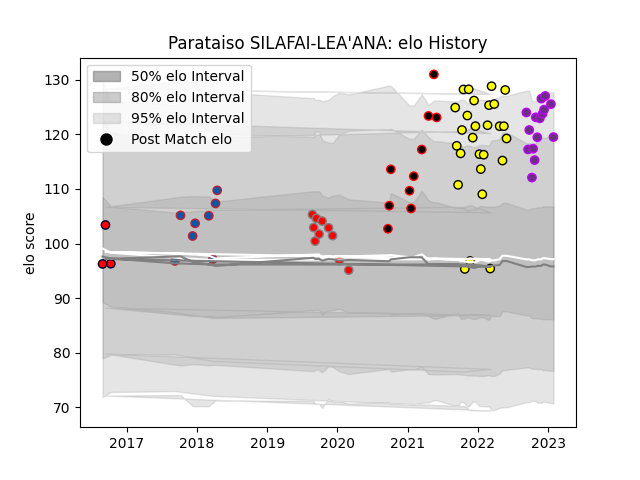

---  
layout: page  
title: Parataiso SILAFAI-LEA'ANA  
date: 2023-01-19 11:41:55.753514  
categories: player  
---
# Parataiso SILAFAI-LEA'ANA

## Positions: C

## Current elo: 125.0

## Current Percentile: 94.0

# Elo History

# Match History

| Team             |   Appearances |   Win Rate |
|:-----------------|--------------:|-----------:|
| Albi             |            24 |   0.708333 |
| US Bressane      |            14 |   0.714286 |
| Roval Drome XV   |            10 |   0        |
| Nice             |             9 |   0.833333 |
| Grenoble         |             8 |   0.875    |
| Melbourne Rising |             3 |   0        |

| Opponent                   |   Matches |   Win Rate |
|:---------------------------|----------:|-----------:|
| Chambery                   |         6 |   0.833333 |
| Tarbes                     |         4 |   0.625    |
| Suresnes                   |         4 |   1        |
| Bourgoin-Jallieu           |         4 |   1        |
| Cognac Saint Jean d'Angély |         4 |   1        |
| Dax                        |         4 |   0.5      |
| Massy                      |         3 |   0.666667 |
| Valence Romans Drome Rugby |         3 |   0.666667 |
| Nice                       |         3 |   0.333333 |
| Blagnac                    |         3 |   1        |
| Soyaux-Angouleme           |         3 |   0.666667 |
| Montauban                  |         3 |   0        |
| Narbonne                   |         2 |   0.5      |
| Albi                       |         2 |   0        |
| Dijon                      |         2 |   1        |
| Carcassonne                |         2 |   0.5      |
| Perth Spirit               |         1 |   0        |
| Rouen                      |         1 |   0        |
| Rennes                     |         1 |   1        |
| US Bressane                |         1 |   1        |
| Provence Rugby             |         1 |   0        |
| NSW Country Eagles         |         1 |   0        |
| Oyonnax                    |         1 |   0        |
| North Harbour Rays         |         1 |   0        |
| Nevers                     |         1 |   0        |
| Aubenas                    |         1 |   1        |
| Carqueiranne-Hyères        |         1 |   1        |
| Biarritz Olympique         |         1 |   0        |
| Beziers                    |         1 |   0        |
| Bayonne                    |         1 |   1        |
| Aurillac                   |         1 |   1        |
| Vannes                     |         1 |   0        |