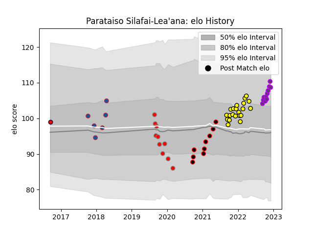

---  
layout: page  
title: Parataiso Silafai-Lea'ana  
date: 2022-12-09 13:06:48.121339  
categories: player  
---
# Parataiso Silafai-Lea'ana

## Positions: C

## Current elo: 109.0

## Current Percentile: 86.0

# Elo History

# Match History

| Team             |   Appearances |   Win Rate |
|:-----------------|--------------:|-----------:|
| Albi             |            21 |   0.666667 |
| US Bressane      |            11 |   0.818182 |
| Roval Drome XV   |            10 |   0        |
| Nice             |             9 |   0.833333 |
| Grenoble         |             6 |   1        |
| Melbourne Rising |             1 |   0        |

| Opponent                   |   Matches |   Win Rate |
|:---------------------------|----------:|-----------:|
| Chambery                   |         5 |   1        |
| Bourgoin-Jallieu           |         4 |   1        |
| Cognac Saint Jean d'Angély |         4 |   1        |
| Massy                      |         3 |   0.666667 |
| Valence Romans Drome Rugby |         3 |   0.666667 |
| Tarbes                     |         3 |   0.5      |
| Blagnac                    |         3 |   1        |
| Soyaux-Angouleme           |         3 |   0.666667 |
| Nice                       |         3 |   0.333333 |
| Dax                        |         3 |   0.666667 |
| Albi                       |         2 |   0        |
| Suresnes                   |         2 |   1        |
| Narbonne                   |         2 |   0.5      |
| Montauban                  |         2 |   0        |
| Dijon                      |         2 |   1        |
| Aurillac                   |         1 |   1        |
| NSW Country Eagles         |         1 |   0        |
| Nevers                     |         1 |   0        |
| Carqueiranne-Hyères        |         1 |   1        |
| Oyonnax                    |         1 |   0        |
| Provence Rugby             |         1 |   0        |
| Rennes                     |         1 |   1        |
| Rouen                      |         1 |   0        |
| Carcassonne                |         1 |   0        |
| Biarritz Olympique         |         1 |   0        |
| Beziers                    |         1 |   0        |
| US Bressane                |         1 |   1        |
| Bayonne                    |         1 |   1        |
| Vannes                     |         1 |   0        |