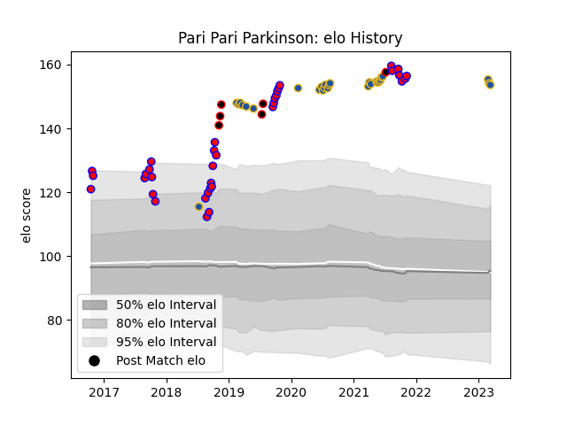

---  
layout: page  
title: Pari Pari Parkinson  
date: 2023-03-02 11:21:56.541774  
categories: player  
---
# Pari Pari Parkinson

## Positions: L

## Country: New Zealand Maori

## Current elo: 155.0

## Current Percentile: None

# Elo History

# Match History

| Team              |   Appearances |   Win Rate |
|:------------------|--------------:|-----------:|
| Tasman            |            35 |   0.742857 |
| Highlanders       |            26 |   0.384615 |
| New Zealand Maori |             6 |   0.833333 |

| Opponent                 |   Matches |   Win Rate |
|:-------------------------|----------:|-----------:|
| Auckland                 |         5 |   0.8      |
| Blues                    |         5 |   0        |
| Canterbury               |         5 |   0.2      |
| Crusaders                |         5 |   0.2      |
| Chiefs                   |         4 |   0.75     |
| Hurricanes               |         4 |   0.25     |
| North Harbour            |         3 |   1        |
| Wellington               |         3 |   1        |
| Waikato                  |         3 |   0.666667 |
| Southland                |         3 |   1        |
| Hawke's Bay              |         3 |   0.666667 |
| Taranaki                 |         2 |   1        |
| Northland                |         2 |   1        |
| Melbourne Rebels         |         2 |   0.5      |
| Manawatu                 |         2 |   0.5      |
| Fiji                     |         2 |   0.5      |
| Counties Manukau         |         2 |   0.5      |
| Bay of Plenty            |         1 |   1        |
| New South Wales Waratahs |         1 |   1        |
| Otago                    |         1 |   1        |
| Queensland Reds          |         1 |   1        |
| Samoa                    |         1 |   1        |
| Sharks                   |         1 |   0        |
| Stormers                 |         1 |   0        |
| Chile                    |         1 |   1        |
| United States of America |         1 |   1        |
| Brumbies                 |         1 |   1        |
| Brazil                   |         1 |   1        |
| Western Force            |         1 |   1        |