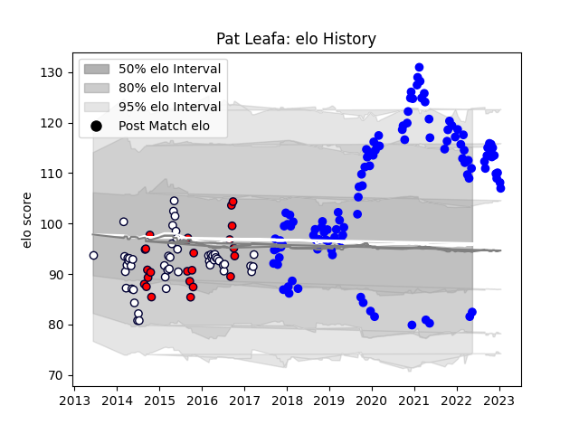

---  
layout: page  
title: Pat Leafa  
date: 2023-01-13 11:27:12.694771  
categories: player  
---
# Pat Leafa

## Positions: H

## Current elo: 82.0

## Current Percentile: 84.0

# Elo History

# Match History

| Team             |   Appearances |   Win Rate |
|:-----------------|--------------:|-----------:|
| Vannes           |           113 |   0.579646 |
| Melbourne Rebels |            51 |   0.352941 |
| Melbourne Rising |            24 |   0.666667 |

| Opponent                   |   Matches |   Win Rate |
|:---------------------------|----------:|-----------:|
| Beziers                    |         9 |   0.777778 |
| Nevers                     |         9 |   0.722222 |
| Mont-de-Marsan             |         8 |   0.625    |
| Carcassonne                |         8 |   0.5625   |
| Colomiers                  |         7 |   0.571429 |
| Biarritz Olympique         |         7 |   0.714286 |
| Provence Rugby             |         7 |   0.571429 |
| Soyaux-Angouleme           |         6 |   0.5      |
| Queensland Reds            |         6 |   0.666667 |
| New South Wales Waratahs   |         6 |   0.166667 |
| Montauban                  |         6 |   0.333333 |
| Aurillac                   |         6 |   0.833333 |
| Western Force              |         6 |   0.666667 |
| Brumbies                   |         6 |   0.333333 |
| Bayonne                    |         5 |   0.4      |
| Massy                      |         5 |   0.6      |
| Oyonnax                    |         5 |   0.6      |
| Agen                       |         4 |   0.25     |
| Grenoble                   |         4 |   0.5      |
| Hurricanes                 |         4 |   0        |
| Perth Spirit               |         4 |   0.25     |
| US Bressane                |         3 |   0.833333 |
| Blues                      |         3 |   0.333333 |
| Queensland Country         |         3 |   1        |
| Brisbane City              |         3 |   0.666667 |
| Perpignan                  |         3 |   0        |
| Chiefs                     |         3 |   0.333333 |
| Narbonne                   |         3 |   0.666667 |
| Canberra Vikings           |         3 |   0.666667 |
| Crusaders                  |         3 |   0.333333 |
| Greater Sydney Rams        |         3 |   0.666667 |
| North Harbour Rays         |         3 |   0.666667 |
| Bulls                      |         3 |   0.333333 |
| NSW Country Eagles         |         3 |   0.666667 |
| Lions                      |         2 |   0        |
| Highlanders                |         2 |   0        |
| Roval Drome XV             |         2 |   1        |
| Sharks                     |         2 |   0        |
| Stormers                   |         2 |   0        |
| Sydney Stars               |         2 |   1        |
| Cheetahs                   |         2 |   1        |
| Valence Romans Drome Rugby |         2 |   0.5      |
| Rouen                      |         2 |   0        |
| Brive                      |         1 |   0        |
| Dax                        |         1 |   1        |
| Sunwolves                  |         1 |   1        |