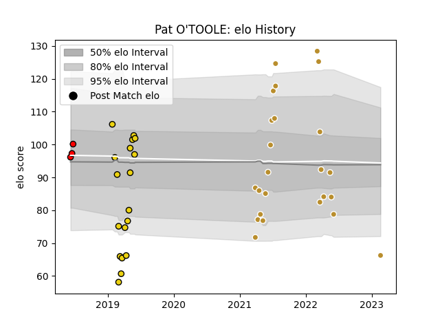

---  
layout: page  
title: Pat O'TOOLE  
date: 2023-03-29 11:30:12.994071  
categories: player  
---
# Pat O'TOOLE

Last updated: 2023-03-29
## Positions: H

## Current elo: 78.0

## Current Percentile: 12.0

# Elo History

# Match History

| Team              |   Appearances |   Win Rate |
|:------------------|--------------:|-----------:|
| NOLA Gold         |            29 |   0.586207 |
| Houston SaberCats |            18 |   0.333333 |
| San Diego Legion  |             3 |   1        |

| Opponent               |   Matches |   Win Rate |
|:-----------------------|----------:|-----------:|
| Rugby New York         |         6 |   0.5      |
| R.U. New York          |         5 |   0.4      |
| Rugby ATL              |         5 |   0        |
| Seattle Seawolves      |         4 |   0.25     |
| Utah Warriors          |         4 |   1        |
| Austin Elite Rugby     |         3 |   1        |
| Glendale Raptors       |         3 |   0.666667 |
| NOLA Gold              |         3 |   0.666667 |
| New England Free Jacks |         3 |   0.666667 |
| Old Glory DC           |         3 |   1        |
| San Diego Legion       |         3 |   0        |
| Toronto Arrows         |         3 |   0.333333 |
| Houston SaberCats      |         2 |   0.5      |
| Austin Gilgronis       |         1 |   0        |
| Dallas Jackals         |         1 |   1        |
| L. A. Giltinis         |         1 |   1        |