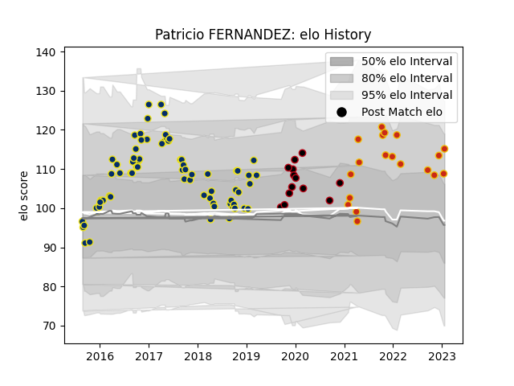

---  
layout: page  
title: Patricio FERNANDEZ  
date: 2023-01-23 15:31:07.725596  
categories: player  
---
# Patricio FERNANDEZ

## Positions: FH

## Current elo: 116.0

## Current Percentile: 78.0

# Elo History

# Match History

| Team              |   Appearances |   Win Rate |
|:------------------|--------------:|-----------:|
| Clermont Auvergne |            72 |   0.694444 |
| Perpignan         |            19 |   0.342105 |
| Lyon              |            13 |   0.615385 |

| Opponent             |   Matches |   Win Rate |
|:---------------------|----------:|-----------:|
| Racing 92            |         9 |   0.555556 |
| Bordeaux Begles      |         9 |   0.611111 |
| La Rochelle          |         8 |   0.5625   |
| Toulon               |         7 |   0.714286 |
| Brive                |         7 |   0.714286 |
| Castres Olympique    |         6 |   0.333333 |
| Stade Toulousain     |         6 |   0.5      |
| Stade Francais Paris |         6 |   0.583333 |
| Pau                  |         5 |   1        |
| Lyon                 |         5 |   0.4      |
| Agen                 |         4 |   0.75     |
| Northampton Saints   |         3 |   0.666667 |
| Exeter Chiefs        |         3 |   0.666667 |
| Grenoble             |         3 |   0.833333 |
| Bristol Rugby        |         2 |   0        |
| Benetton Treviso     |         2 |   0.5      |
| Montpellier Herault  |         2 |   0.5      |
| Dragons              |         2 |   1        |
| Bayonne              |         1 |   1        |
| Timisoara Saracens   |         1 |   1        |
| Beziers              |         1 |   1        |
| Soyaux-Angouleme     |         1 |   1        |
| Saracens             |         1 |   0        |
| Biarritz Olympique   |         1 |   1        |
| Clermont Auvergne    |         1 |   0        |
| Oyonnax              |         1 |   1        |
| Nevers               |         1 |   1        |
| Montauban            |         1 |   0        |
| Carcassonne          |         1 |   1        |
| Leinster             |         1 |   1        |
| Aurillac             |         1 |   0.5      |
| Glasgow Warriors     |         1 |   0        |
| Ulster               |         1 |   1        |