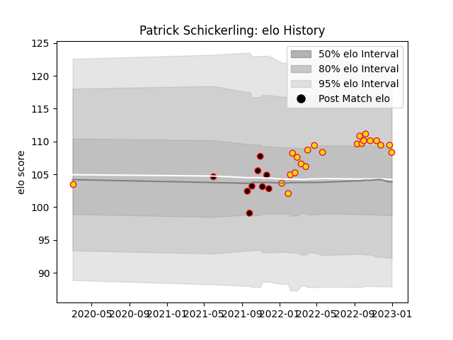

---  
layout: page  
title: Patrick Schickerling  
date: 2023-02-02 19:04:30.309351  
categories: player  
---
# Patrick Schickerling

## Positions: P

## Current elo: 103.0

## Current Percentile: 69.0

# Elo History

# Match History

| Team            |   Appearances |   Win Rate |
|:----------------|--------------:|-----------:|
| Exeter Chiefs   |            23 |   0.478261 |
| Cornish Pirates |             9 |   0.666667 |

| Opponent            |   Matches |   Win Rate |
|:--------------------|----------:|-----------:|
| Harlequins          |         3 |   0.333333 |
| Saracens            |         3 |   0        |
| Bath Rugby          |         2 |   1        |
| Newcastle Falcons   |         2 |   0.5      |
| Leicester Tigers    |         2 |   0.5      |
| Jersey              |         2 |   0        |
| London Irish        |         2 |   0.5      |
| Gloucester Rugby    |         2 |   1        |
| Bristol Rugby       |         2 |   0.5      |
| Worcester Warriors  |         2 |   0.5      |
| Hartpury College    |         1 |   0        |
| Ealing Trailfinders |         1 |   1        |
| Bedford             |         1 |   1        |
| London Scottish     |         1 |   1        |
| Coventry            |         1 |   1        |
| Northampton Saints  |         1 |   1        |
| Nottingham          |         1 |   1        |
| Richmond            |         1 |   1        |
| Sale Sharks         |         1 |   0        |
| Wasps               |         1 |   0        |