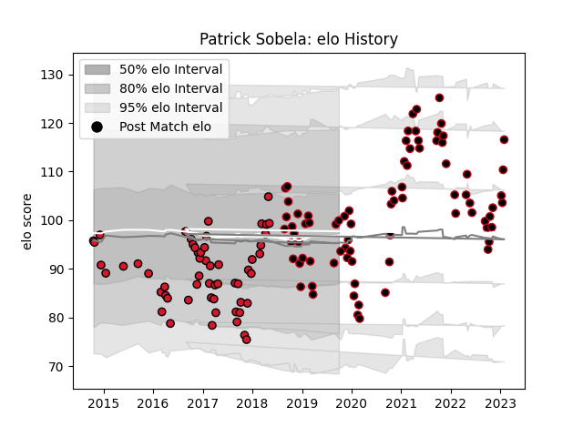

---  
layout: page  
title: Patrick Sobela  
date: 2023-01-13 11:27:40.289983  
categories: player  
---
# Patrick Sobela

## Positions: FL, N8

## Current elo: 100.0

## Current Percentile: 37.0

# Elo History

# Match History

| Team    |   Appearances |   Win Rate |
|:--------|--------------:|-----------:|
| Lyon    |            76 |   0.565789 |
| Oyonnax |            56 |   0.464286 |

| Opponent             |   Matches |   Win Rate |
|:---------------------|----------:|-----------:|
| Castres Olympique    |         9 |   0.222222 |
| Montpellier Herault  |         9 |   0.666667 |
| Stade Francais Paris |         9 |   0.666667 |
| Bordeaux Begles      |         9 |   0.333333 |
| Brive                |         9 |   0.555556 |
| Racing 92            |         8 |   0.375    |
| Toulon               |         8 |   0.5      |
| Clermont Auvergne    |         7 |   0.5      |
| Perpignan            |         6 |   0.666667 |
| Pau                  |         6 |   0.583333 |
| La Rochelle          |         5 |   0.2      |
| Agen                 |         5 |   0.8      |
| Stade Toulousain     |         5 |   0.6      |
| Biarritz Olympique   |         3 |   0.666667 |
| Bayonne              |         3 |   1        |
| Bourgoin-Jallieu     |         2 |   1        |
| Soyaux-Angouleme     |         2 |   1        |
| Dax                  |         2 |   0.5      |
| Glasgow Warriors     |         2 |   0        |
| Gloucester Rugby     |         2 |   0        |
| Albi                 |         2 |   1        |
| Vannes               |         2 |   0.5      |
| Mont-de-Marsan       |         2 |   0.5      |
| Benetton Treviso     |         2 |   0.5      |
| Narbonne             |         2 |   0.5      |
| Northampton Saints   |         2 |   0        |
| Aurillac             |         2 |   1        |
| Grenoble             |         1 |   0        |
| Saracens             |         1 |   0        |
| Lyon                 |         1 |   1        |
| Colomiers            |         1 |   0        |
| Cardiff Blues        |         1 |   0        |
| Beziers              |         1 |   1        |
| Zebre                |         1 |   1        |