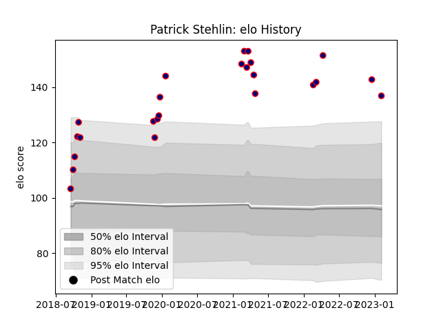

---  
layout: page  
title: Patrick Stehlin  
date: 2023-02-09 13:55:48.176840  
categories: player  
---
# Patrick Stehlin

## Positions: C, FH

## Current elo: 137.0

## Current Percentile: 99.0

# Elo History

# Match History

| Team                     |   Appearances |   Win Rate |
|:-------------------------|--------------:|-----------:|
| Hanazono Kintetsu Liners |            24 |   0.833333 |

| Opponent                         |   Matches |   Win Rate |
|:---------------------------------|----------:|-----------:|
| Kamaishi Seawaves                |         4 |        1   |
| Kurita Water Gush                |         3 |        1   |
| Coca-Cola Red Sparks             |         2 |        1   |
| Kyuden Voltex                    |         2 |        1   |
| Shimizu Blue Sharks              |         2 |        1   |
| Toyota Industries Shuttles Aichi |         2 |        0.5 |
| Chugoku Red Regulions            |         1 |        1   |
| Green Rockets Tokatsu            |         1 |        0   |
| Mazda Blue Zoomers               |         1 |        1   |
| Mitsubishi Dynaboars             |         1 |        1   |
| Munakata Sanix Blues             |         1 |        1   |
| NTT Docomo Red Hurricanes Osaka  |         1 |        1   |
| Saitama Wild Knights             |         1 |        0   |
| Shizuoka Blue Revs               |         1 |        0   |
| Skyactivs Hiroshima              |         1 |        1   |