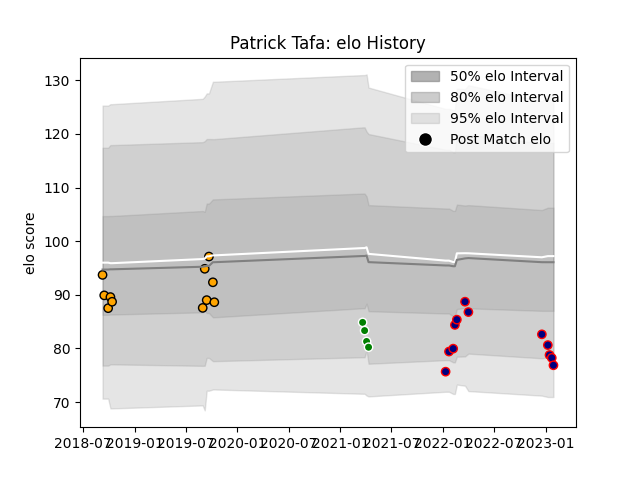

---  
layout: page  
title: Patrick Tafa  
date: 2023-02-02 19:03:40.620254  
categories: player  
---
# Patrick Tafa

## Positions: L, FL

## Current elo: 77.0

## Current Percentile: 16.0

# Elo History

# Match History

| Team                     |   Appearances |   Win Rate |
|:-------------------------|--------------:|-----------:|
| Hanazono Kintetsu Liners |            12 |   0.5      |
| NSW Country Eagles       |            11 |   0.227273 |
| Green Rockets Tokatsu    |             4 |   0        |

| Opponent                          |   Matches |   Win Rate |
|:----------------------------------|----------:|-----------:|
| Hino Red Dolphins                 |         3 |   0.666667 |
| Mie Honda Heat                    |         2 |   1        |
| Queensland Country                |         2 |   0        |
| Brisbane City                     |         2 |   0        |
| Melbourne Rising                  |         2 |   0.5      |
| Yokohama Canon Eagles             |         2 |   0        |
| Fijian Drua                       |         2 |   0.25     |
| Kamaishi Seawaves                 |         1 |   1        |
| Kubota Spears Funabashi Tokyo-Bay |         1 |   0        |
| Green Rockets Tokatsu             |         1 |   0        |
| Mitsubishi Dynaboars              |         1 |   0        |
| Canberra Vikings                  |         1 |   0        |
| Saitama Wild Knights              |         1 |   0        |
| Skyactivs Hiroshima               |         1 |   1        |
| Sydney Rays                       |         1 |   1        |
| Tokyo Sungoliath                  |         1 |   0        |
| Toshiba Brave Lupus Tokyo         |         1 |   0        |
| Western Force                     |         1 |   0        |
| Black Rams Tokyo                  |         1 |   0        |